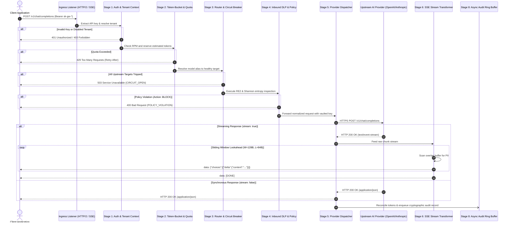
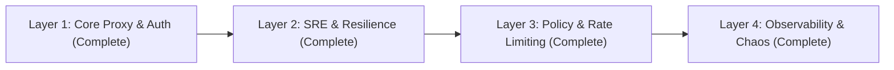

# AI Gateway Master Design Document

## Document Metadata
- **Status**: Approved for Implementation
- **Version**: 1.0.0
- **Domain**: AI Infrastructure / Application Security / Site Reliability Engineering
- **Implementation Language**: Go 1.23+
- **Primary References**:
  - Foundational Philosophy: [00-PROJECT-PHILOSOPHY.md](file:///root/company-project-specs/00-PROJECT-PHILOSOPHY.md)
  - Project Spec: [01-ai-gateway.md](file:///root/company-project-specs/01-ai-gateway.md)
  - System Architecture: [ARCHITECTURE.md](file:///root/ai-gateway/docs/ARCHITECTURE.md)
  - Security Boundaries: [SECURITY-BOUNDARIES.md](file:///root/ai-gateway/docs/SECURITY-BOUNDARIES.md)
  - Threat Model: [THREAT-MODEL.md](file:///root/ai-gateway/docs/THREAT-MODEL.md)
  - Failure Modes & Effects Analysis: [FAILURE-MODES.md](file:///root/ai-gateway/docs/FAILURE-MODES.md)
  - Service Level Objectives & Observability: [SLO.md](file:///root/ai-gateway/docs/SLO.md)
  - Operational Runbooks & Deployment: [OPERATIONS.md](file:///root/ai-gateway/docs/OPERATIONS.md)
  - Architectural Decision Records:
    - [ADR-001: Language & Runtime Selection](file:///root/ai-gateway/docs/adr/ADR-001-language-and-runtime-selection.md)
    - [ADR-002: Proxy Pipeline Architecture](file:///root/ai-gateway/docs/adr/ADR-002-proxy-pipeline-architecture.md)
    - [ADR-003: State Management & Rate Limiting](file:///root/ai-gateway/docs/adr/ADR-003-state-and-rate-limiting.md)
    - [ADR-004: Streaming Policy Enforcement](file:///root/ai-gateway/docs/adr/ADR-004-streaming-policy-enforcement.md)

---

## 1. Executive Summary & Thesis

The AI Gateway is a specialized, production-hardened network proxy and policy engine designed to govern enterprise interactions with public Large Language Model (LLM) providers (OpenAI, Anthropic, Google Vertex AI, Azure OpenAI) and private inference clusters (vLLM, TensorRT-LLM, Triton).

### Core Architectural Principle
> **"AI proposes. Deterministic systems enforce. Boring, reliable infrastructure."**

Probabilistic components (LLMs) generate suggestions, completions, and unstructured inferences. The control plane governing them—access control, tenant isolation, rate limits, token quotas, circuit breaking, data loss prevention (DLP), and audit verification—must remain strictly **deterministic**.

---

## 2. System Architecture & Request Lifecycle

---

## 3. Core Engine Specifications

### 3.1 Linear Stage Pipeline Machine (ADR-002)
Rather than a traditional nested middleware onion (`http.Handler`), the gateway employs an explicit linear pipeline state machine with checkpointing:
- **Zero Heap Allocations on Fast Path**: Internal request/response contexts and 4KB streaming buffers are pooled via `sync.Pool`.
- **Two-Phase Token Accounting**: Speculatively reserves tokens (prompt length $\times 1.33 + \text{max\_tokens}$) and reconciles exact counts upon completion.
- **Immediate Context Teardown**: Intercepts `r.Context().Done()` on client disconnects and cancels the upstream HTTP socket immediately, eliminating zombie compute spend.

### 3.2 Resilience & Health Engine (FAILURE-MODES.md)
- **Circuit Breaker State Machine**:
  - `CLOSED`: Normal operation. Tracks error rate over sliding 60s window ($N_{\min} = 20$).
  - `OPEN`: Trips when error rate $E \ge 50\%$. Fails fast with cached fallback routes for $T_{\text{cooldown}} = 30\text{s}$.
  - `HALF-OPEN`: Dispatches 5 canary probes. Recovers to `CLOSED` upon 100% success; re-trips immediately on a single error.
- **Provider Outage Cascades**: Automatic prioritized routing across model tiers (e.g. `gpt-4o` $\to$ `claude-3-5-sonnet` $\to$ on-prem `llama-3.3-70b`).
- **Full Jitter Exponential Backoff**:
  $$\text{Sleep} = \text{Uniform}\left(0, \; \min\left(T_{\max}, \; T_{\text{base}} \times 2^{\text{attempt}}\right)\right)$$

### 3.3 Security & Deterministic DLP (SECURITY-BOUNDARIES.md)
- **Zero Trust Ingress**: Validates caller API keys using constant-time comparison against Argon2id or salted SHA-256 hashes.
- **KMS Vaulted Provider Keys**: Master provider credentials stored encrypted (AES-256-GCM) with runtime memory zeroization (`memzero`) upon eviction.
- **Deterministic DLP Engine**: Non-backtracking RE2 automata and Shannon entropy analysis ($H(X) \ge 4.5\text{ bits/symbol}$) executing in guaranteed linear time $O(n)$ to eliminate ReDoS vulnerabilities.
- **Streaming Lookahead Buffer (ADR-004)**: Fixed sliding window lookahead buffer ($W=128\text{ bytes}, L=64\text{ bytes}$) ensuring sensitive patterns crossing chunk boundaries are caught before client release with bounded $\approx 85\text{ms}$ TTFT impact.

### 3.4 Service Level Objectives & Telemetry (SLO.md)
- **Overhead Latency SLI**: Isolated from upstream model inference duration:
  - $p_{50} < 2\text{ms}$
  - $p_{95} < 8\text{ms}$
  - $p_{99} < 15\text{ms}$
- **Availability SLO**: $99.95\%$ successful dispatch over rolling 30-day window.
- **Prometheus Metrics**: Standardized OpenTelemetry GenAI semantic conventions including `ai_gateway_overhead_duration_seconds`, `ai_gateway_upstream_duration_seconds`, `ai_gateway_tokens_total`, and `ai_gateway_circuit_breaker_state`.

---

## 4. Key Architectural Decision Records (ADRs)

1. **[ADR-001: Language and Runtime Selection](file:///root/ai-gateway/docs/adr/ADR-001-language-and-runtime-selection.md)**
   - **Decision**: Go 1.23+ with standard library `net/http` and goroutines.
   - **Rationale**: Sub-millisecond proxy overhead, 200MB memory footprint for 10k SSE streams (vs Python's 2.5GB), GC pauses $< 500\mu\text{s}$, and single static binary deployment (`FROM scratch`).

2. **[ADR-002: Proxy Pipeline Architecture](file:///root/ai-gateway/docs/adr/ADR-002-proxy-pipeline-architecture.md)**
   - **Decision**: Explicit linear stage machine over nested middleware onion.
   - **Rationale**: Enables multi-provider retry loops without stack explosion, two-phase token reservation, and zero-copy streaming.

3. **[ADR-003: State Management and Rate Limiting](file:///root/ai-gateway/docs/adr/ADR-003-state-and-rate-limiting.md)**
   - **Decision**: Hybrid tiered state (Redis cluster sliding window + local in-memory fallback).
   - **Rationale**: Redis partition results in fail-soft local rate limiting, but fail-closed security enforcement.

4. **[ADR-004: Streaming Policy Enforcement](file:///root/ai-gateway/docs/adr/ADR-004-streaming-policy-enforcement.md)**
   - **Decision**: Fixed sliding window lookahead buffer ($W=128\text{B}, L=64\text{B}$).
   - **Rationale**: Inspects cross-chunk patterns without the unbounded latency stalls of sentence-boundary buffers.

---

## 5. Implemented System Layers & Production Verification

### Layer 1: Core Proxy & Multi-Tenant Authentication (Complete & Verified)
- Ingress HTTP/1.1 and HTTP/2 listener on `:8080` with OpenAI wire protocol compatibility.
- Linear pipeline stage runner and `TenantContext` resolution.
- Constant-time API key verification against memory/YAML store ([`crypto/subtle`](file:///root/ai-gateway/internal/auth/auth.go)).
- Upstream client dispatcher for OpenAI chat completion protocol.
- Streaming SSE chunk pass-through with active upstream socket teardown on client context cancellation.

### Layer 2: SRE Resilience & Health Engine (Complete & Verified)
- In-memory Circuit Breaker state machine (`Closed`, `Open`, `Half-Open`) with 60s sliding ring buffers.
- Dynamic routing engine with multi-tier fallback priority cascades (`Tier 0` $\to$ `Tier 1` $\to$ `Tier 2`).
- Full Jitter exponential backoff retries on transient errors (502/503/504) and `Retry-After` parsing.
- Background health checking daemon integrated with `/healthz/readiness`.

### Layer 3: Deterministic Policy & Rate Limiting (Complete & Verified)
- Sliding-window RPM rate limiter and concurrency semaphores.
- Two-phase speculative token reservation (TPM) with post-dispatch reconciliation.
- Deterministic DLP inspection engine (linear-time RE2 regex for PAN/SSN/AWS keys + Shannon entropy $H(X) \ge 4.5$).
- Sliding-window lookahead buffer ($W=128\text{B}, L=64\text{B}$) for streaming SSE redaction and aborts.

### Layer 4: Observability, Security Hardening & Chaos Testing (Complete & Verified)
- Native Prometheus `/metrics` endpoint with fine-grained proxy overhead duration histograms ($p_{99} < 15\text{ms}$).
- W3C distributed tracing with `traceparent` context propagation.
- Cryptographically chained SHA-256 tamper-evident audit ledger with automated `VerifyChain` validation.
- Comprehensive chaos and end-to-end integration test suite (74 tests passing with 0 failures).
