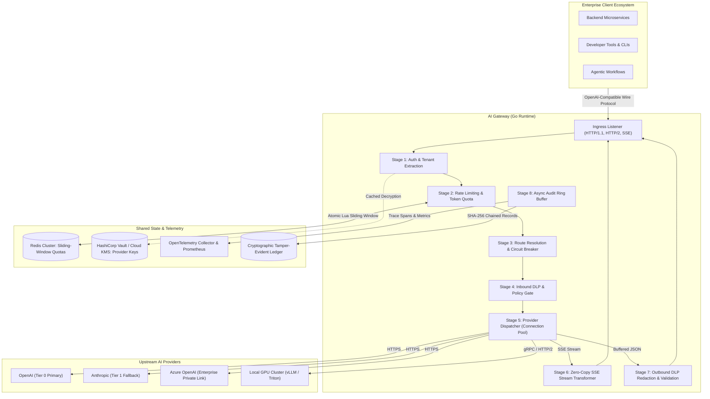

# AI Gateway

> **"AI proposes. Deterministic systems enforce. Boring, reliable infrastructure."**

The **AI Gateway** is an enterprise-grade, high-performance control plane positioned between client applications and heterogeneous Large Language Model (LLM) providers (OpenAI, Anthropic, Google Vertex AI, Azure OpenAI, and self-hosted vLLM/Triton clusters).

It unifies API integration, credential isolation, deterministic security enforcement (DLP/PII), rate-limiting/token budgeting, health-aware resilience routing (circuit breaking, fallback cascades), and real-time streaming observability.

---

## Architectural Documentation Suite

The complete technical design specification is organized across dedicated, high-rigor engineering documents:

| Document | Focus & Scope | Key Topics |
| :--- | :--- | :--- |
| **[ARCHITECTURE.md](file:///root/ai-gateway/docs/ARCHITECTURE.md)** | Core Architecture & Engine Design | System topology, 8-stage execution pipeline, OpenAI-compatible wire protocol, canonical types, Go interfaces, routing cascades, YAML configuration schema. |
| **[SECURITY-BOUNDARIES.md](file:///root/ai-gateway/docs/SECURITY-BOUNDARIES.md)** | Security Architecture & Enforcement | Zero trust boundaries, cryptographic tenant isolation (HKDF), upstream key vaulting (AES-256-GCM), deterministic DLP (RE2 & Shannon entropy), audit hash chaining. |
| **[THREAT-MODEL.md](file:///root/ai-gateway/docs/THREAT-MODEL.md)** | Formal STRIDE Analysis | 19 threat vectors evaluated, prompt injection defenses, indirect RAG injection mitigations, systemic denial of wallet (EDoS) controls. |
| **[FAILURE-MODES.md](file:///root/ai-gateway/docs/FAILURE-MODES.md)** | FMEA & Resilience Engineering | Comprehensive FMEA matrix, circuit breaker state machine, Full Jitter backoff algorithms, upstream 5xx/429 handling, stream hang timeouts. |
| **[SLO.md](file:///root/ai-gateway/docs/SLO.md)** | Reliability, SLOs & Observability | Gateway overhead latency ($p_{99} < 15\text{ms}$), 99.95% availability SLO, multi-window burn-rate alerts, Prometheus metrics catalog, OpenTelemetry GenAI tracing. |
| **[OPERATIONS.md](file:///root/ai-gateway/docs/OPERATIONS.md)** | Deployment, Runbooks & SRE | Standalone systemd & Kubernetes Pod specs, zero-downtime rolling deploys, graceful drain lifecycle, on-call incident runbooks, chaos testing. |

### Architecture Decision Records (ADRs)

- **[ADR-001: Language and Runtime Selection](file:///root/ai-gateway/docs/adr/ADR-001-language-and-runtime-selection.md)**: Go 1.23+ with standard library `net/http` and goroutine concurrency over Rust, Python, and Envoy C++/Wasm.
- **[ADR-002: Proxy Pipeline Architecture](file:///root/ai-gateway/docs/adr/ADR-002-proxy-pipeline-architecture.md)**: Explicit linear stage machine with checkpointing and zero-copy SSE streaming over nested middleware onions.
- **[ADR-003: State Management and Rate Limiting](file:///root/ai-gateway/docs/adr/ADR-003-state-and-rate-limiting.md)**: Hybrid tiered state (Redis cluster sliding window + local in-memory fallback), two-phase token reservation, fail-secure vs fail-open trade-offs.
- **[ADR-004: Streaming Policy Enforcement](file:///root/ai-gateway/docs/adr/ADR-004-streaming-policy-enforcement.md)**: Fixed sliding window lookahead buffer ($W=128\text{B}, L=64\text{B}$) for streaming DLP without degrading Time-To-First-Token (TTFT).

---

## High-Level System Architecture

---

## Core Guarantees

1. **Deterministic Enforcement**: Authorization, tenant quotas, DLP masking, and circuit breaking never depend on non-deterministic LLM classifiers.
2. **Sub-15ms Gateway Overhead**: Strict $p_{99} < 15\text{ms}$ latency budget ($p_{50} < 2\text{ms}$) isolating gateway proxy mechanics from upstream LLM inference duration.
3. **Fail-Closed Security & Fail-Soft Availability**: Security policy failures and authentication timeouts fail closed; rate-limiting state store partitions fail soft to local in-memory quotas.
4. **Zero-Copy Streaming**: Bounded 4KB buffer recycling via `sync.Pool` with context-cancellation teardown to prevent zombie token billing.
5. **Full Protocol Compatibility**: Native OpenAI REST API drop-in compatibility (`/v1/chat/completions`, `/v1/models`, `/v1/embeddings`).

---

## Next Steps: Phased Implementation Roadmap

* **Layer 1: Core Proxy & Multi-Tenant Authentication**: Ingress server, pipeline runner, API key verification, and basic OpenAI proxying.
* **Layer 2: SRE Resilience & Health Engine**: Circuit breaker state machine, Full Jitter retries, timeout budgets, and fallback cascades.
* **Layer 3: Deterministic Policy & Rate Limiting**: Redis sliding-window rate limiting, two-phase token reservation, and RE2/entropy DLP inspection.
* **Layer 4: Observability & Operational Tooling**: Prometheus metrics endpoint, OpenTelemetry tracing, audit log hash chaining, and chaos test harness.
