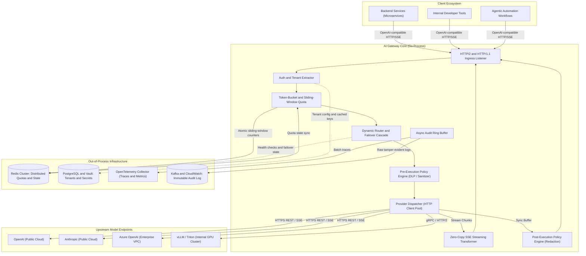
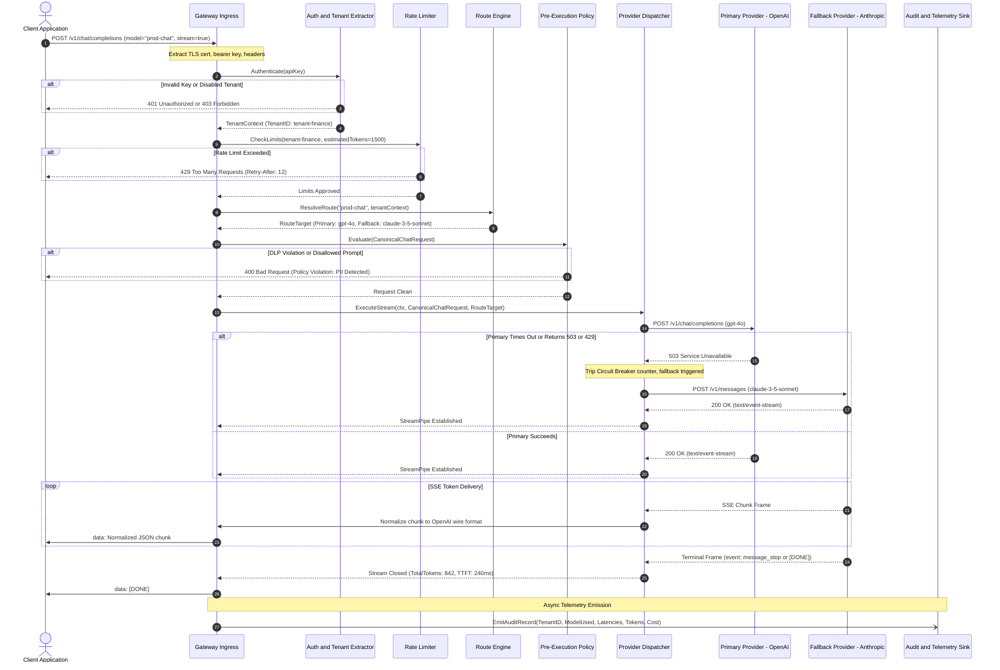
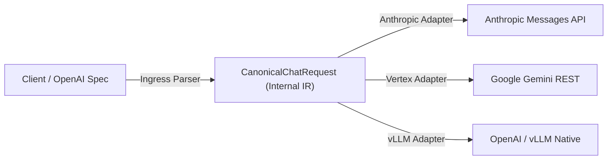
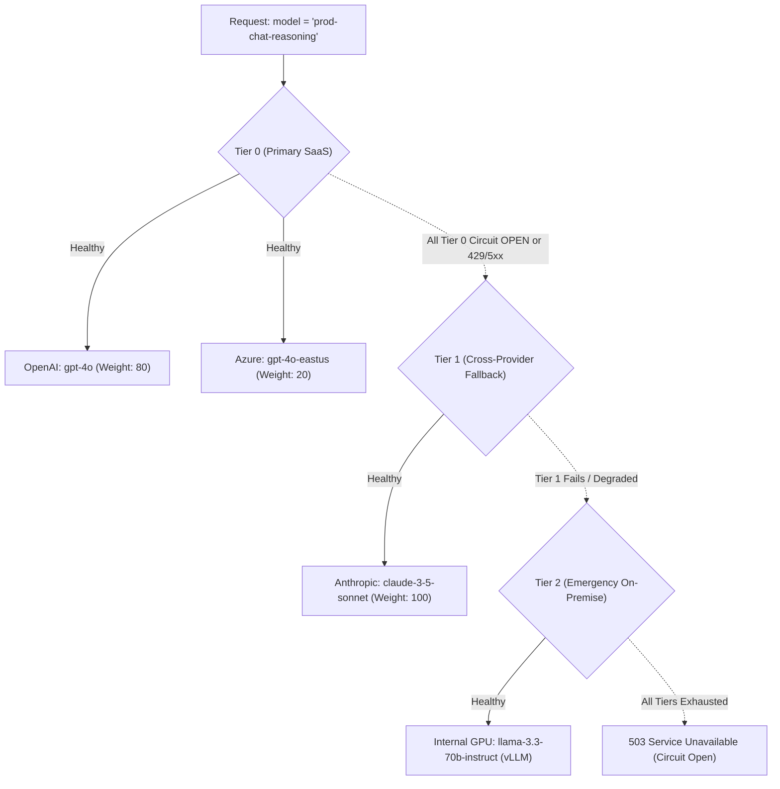
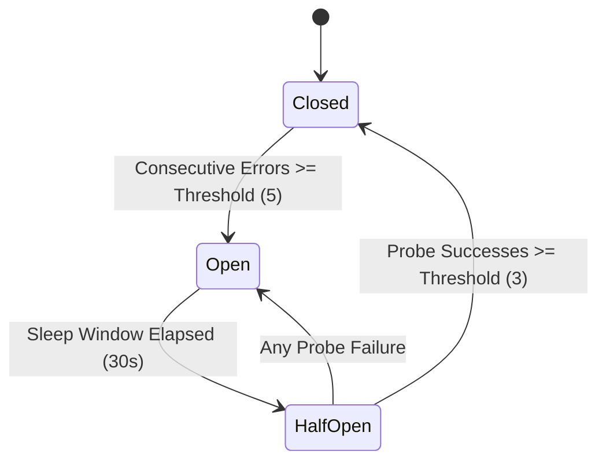

# AI Gateway Architecture Specification

## 1. Overview & Design Thesis

### 1.1 Mission & Purpose

The AI Gateway serves as the centralized, policy-enforcing control plane between enterprise client applications and heterogeneous Large Language Model (LLM) providers—spanning public SaaS APIs (e.g., OpenAI, Anthropic, Google Vertex AI, Azure OpenAI) and private self-hosted inference clusters (e.g., vLLM, TensorRT-LLM, Triton).

As artificial intelligence workloads permeate production systems, direct ad-hoc point-to-point client integrations introduce severe operational liabilities:
- Fragmented credential proliferation and heightened blast radiuses during key leaks.
- Zero company-wide visibility into token spend, cost attribution, and usage surges.
- Fragility in the face of upstream provider degradation, global rate limits, or regional outages.
- Inability to consistently apply security guardrails (Data Loss Prevention, PII masking, Prompt Injection detection) across diverse business units.

The AI Gateway decouples client applications from upstream vendor nuances. It provides unified billing attribution, deterministic security enforcement, health-aware resilience routing, and real-time streaming observability.

### 1.2 The Core Thesis

> **"AI proposes. Deterministic systems enforce. Boring, reliable infrastructure."**

The architectural thesis directly implements `/root/company-project-specs/00-PROJECT-PHILOSOPHY.md` and `/root/company-project-specs/01-ai-gateway.md`:
1. **Probabilistic Reasoning Belongs at the Periphery**: LLMs operate probabilistically. They generate suggestions, completions, and classifications. However, critical control systems—access control, quota enforcement, tenant boundaries, rate limits, audit verification, and deployment gates—must remain strictly **deterministic**. An LLM shall never be the final arbiter of security policies or access grants.
2. **Boring, Reliable Infrastructure**: We reject distributed orchestrator hype, speculative multi-agent autonomy frameworks, and unproven microservice sprawl. The gateway core is engineered as a lean, statically compiled, highly performant Go process leveraging battle-tested networking primitives (`net/http`, atomic synchronization, zero-allocation buffer pools).
3. **No Hidden Magic**: Routing decisions, failover transitions, circuit tripping, and token accounting execute according to explicit, testable, and observable rules. If a model fails or a policy rejects a prompt, the failure mode is surfaced unambiguously with structured diagnostics.
4. **Resilience to Failure**: Upstream providers fail frequently (elevated latency, 429 throttling, 503 capacity shortages, dropped SSE streams). The gateway is built from day one under the assumption that external dependencies are hostile, slow, and unreliable.

---

## 2. System Topology & Component Boundaries

### 2.1 Topology Overview

The AI Gateway operates as an edge or internal ingress proxy within the corporate network topology. It terminates client connections, enforces identity and policies, routes requests to target model endpoints, and bridges streaming protocols.



### 2.2 Component Boundaries & Responsibilities

| Component | Responsibility | Failure Domain | Recovery Strategy |
| :--- | :--- | :--- | :--- |
| **Ingress & TLS Termination** | Negotiates HTTP/1.1 and HTTP/2, parses headers, enforces body size limits (e.g. max 16MB), binds client cancellation contexts. | Edge network | Hard disconnect; closes client socket immediately. |
| **Auth & Tenant Extractor** | Validates API Keys, JWT bearer tokens, or mTLS client certificates. Resolves `TenantID`, project tags, and role-based entitlements. | Security Perimeter | Fail closed (`401 Unauthorized` / `403 Forbidden`). |
| **Rate Limiter & Quota Pre-check** | Evaluates dual limits: Requests Per Minute (RPM) and Tokens Per Minute (TPM). Employs local in-memory token buckets backed by Redis sliding logs for multi-instance clusters. | Operational Availability | Configurable: Fail open or fail closed with `429 Too Many Requests`. Degrades to local memory when Redis is partitioned. |
| **Route Engine** | Resolves requested model aliases (e.g., `prod-reasoning`) to prioritized upstream endpoints based on availability, tier weighting, and cost matrix. | Routing | Executes deterministic fallback cascade; if all fail, emits `503 Service Unavailable`. |
| **Pre-Execution Policy Engine** | Scans raw prompts for prohibited patterns, proprietary secret leakage (DLP), injection markers, and excessive token reservations. | Security & Compliance | Rejection with `400 Bad Request` or `422 Unprocessable Entity` containing structured violation metadata. |
| **Provider Dispatcher** | Executes outbound requests using dedicated connection pools (`keep-alive`, tuned timeouts, TLS session reuse). Translates canonical schema to provider-specific payloads. | External Dependency | Automatic retry across fallback cascade targets upon transient transport errors or 5xx/429 status codes. |
| **SSE Streaming Transformer** | Streams Server-Sent Events incrementally from upstream to downstream with zero memory accumulation. Parses token framing on the fly for metrics. | Real-time I/O | Immediate teardown of upstream socket when client cancels context (`r.Context().Done()`). |
| **Post-Execution Policy Engine** | Performs real-time or end-of-stream DLP inspection on model completions. Masks sensitive PII before final delivery. | Compliance | Redacts output tokens or replaces malicious output with structured compliance rejection message. |
| **Audit & Metrics Pipeline** | Dispatches non-blocking usage events, token counts, TTFT (Time-To-First-Token), and ITL (Inter-Token Latency) into high-throughput ring buffers. | Observability | Ring buffer drops low-priority debug records under memory saturation while strictly preserving billing/audit events. |

---

## 3. End-to-End Request-Response Pipeline

### 3.1 Sequence Diagram



### 3.2 Detailed Pipeline Stages

#### Stage 1: Ingestion & Connection Handling
- The server binds to configured TCP ports with standard TLS 1.3/1.2 suites.
- HTTP request limits are enforced immediately:
  - Header read timeout: `5s`
  - Max header size: `64KB`
  - Request body limit: enforced via `http.MaxBytesReader(w, r.Body, maxBodyBytes)` (default: `16MB`).
- A root cancellation context is initialized from `r.Context()`. Any client network severance triggers downstream context cancellation immediately.

#### Stage 2: Tenant Extraction & Authentication
- Authenticates caller using hierarchical strategies:
  1. `Authorization: Bearer <sk-gateway-...>`
  2. `X-Tenant-Key: <key>`
  3. Client TLS certificate Subject Distinguished Name (mTLS).
- Matches key against local LRU cache (TTL: 60s) backed by the configuration store.
- Rejects revoked or expired keys with `401 Unauthorized`.
- Extracts `TenantContext` containing: `TenantID`, `Tier`, `AllowedModels`, `DataClassificationLevel`, `BudgetLimits`.

#### Stage 3: Rate Limiting & Quota Pre-check
- Implements two tiers of rate limiting:
  1. **Burst Concurrency**: Max concurrent inflight requests per tenant enforced via local Go semaphores.
  2. **Sliding-Window Quotas**:
     - Requests Per Minute (RPM).
     - Estimated Tokens Per Minute (TPM). An initial token estimate is computed using heuristic character-to-token multipliers (`len(prompt) / 4`).
- Cluster-wide synchronization uses atomic Redis scripts (`cl_evalsha`) implementing the Generic Cell Rate Algorithm (GCRA) / leaky bucket.
- If Redis is partitioned or unreachable, the gateway falls back to local in-memory token buckets to prevent global cascading lockouts.

#### Stage 4: Route Resolution & Target Selection
- Maps requested model alias (e.g. `fast-cheap` or `reasoning-heavy`) to an active `RouteDefinition`.
- Filters targets by tenant permissions (e.g., restricted tenants cannot route to external SaaS models without HIPAA/SOC2 signed upstreams).
- Evaluates circuit breaker states:
  - If a target has sustained `N` consecutive errors within time window `T`, it transitions from `CLOSED` to `OPEN`.
  - The router skips `OPEN` targets and advances down the priority tier cascade.

#### Stage 5: Pre-Execution Policy Enforcement
- Evaluates deterministic security rules before passing payload to network dispatchers:
  - **DLP / PII Filter**: High-performance regex engine (using Google RE2 semantics to guarantee linear execution time) checking for Social Security Numbers, Credit Card PANs, AWS Access Keys, and private RSA keys.
  - **Prompt Length & Context Window Validation**: Verifies that input tokens do not exceed the target model’s declared `max_context_window`.
  - **Prompt Injection & Canary Probes**: Scans for known jailbreak triggers and validates developer-injected canary integrity.
- Rejection halts the pipeline immediately without charging token quotas or touching upstream networks.

#### Stage 6: Provider Dispatcher Execution
- Normalizes canonical request into upstream-specific API schemas (e.g. converting OpenAI tool format to Anthropic tool use structures).
- Attaches provider credentials retrieved securely from memory or HashiCorp Vault.
- Executes HTTP request via tuned persistent `http.Transport`:
  - `MaxIdleConns`: 10,000
  - `MaxIdleConnsPerHost`: 500
  - `IdleConnTimeout`: 90s
  - `DisableCompression`: false
  - `ForceAttemptHTTP2`: true
- Handles non-streaming responses by reading response bodies with explicit buffer size caps.
- Handles streaming responses by invoking the zero-copy SSE transformer.

#### Stage 7: Post-Execution Policy Enforcement
- For non-streaming requests: The entire response body is inspected for outbound secret leakage or unredacted PII.
- For streaming requests: Tokens are parsed through an incremental windowed scanner. If a violation is encountered mid-stream, the stream is abruptly aborted, and an error frame `data: {"error": {"message": "Policy Violation: sensitive data intercepted"}}` is injected before closing the connection.

#### Stage 8: Audit Logging & Metric Emission
- Constructs structured audit event:
  - `RequestID`, `TenantID`, `UserID`, `ResolvedModel`, `UpstreamProvider`, `UpstreamStatus`
  - Prompt tokens, completion tokens, total tokens
  - Time To First Token (TTFT), Total Duration, Downstream Client Latency
  - Policy decisions and violation counters
- Enqueues event into an in-memory lock-free ring buffer for asynchronous flushing to Kafka and OpenTelemetry collectors. Request latency is never blocked on audit network I/O.

---

## 4. API Normalization Specification

### 4.1 Wire Protocol Compatibility

To achieve frictionless drop-in replacement for existing software, the AI Gateway strictly implements the **OpenAI REST Wire Protocol**:
- `POST /v1/chat/completions`: Interactive conversation, tool calling, structured outputs, SSE streaming.
- `GET /v1/models`: Enumerates virtual model aliases and concrete models accessible to the calling tenant.
- `POST /v1/embeddings`: Batch text vectorization.

### 4.2 Unified Internal Canonical Representation

The gateway normalizes all incoming traffic into an immutable internal Intermediate Representation (IR). Upstream provider adapters translate between the IR and concrete vendor schemas.



#### Canonical Types Definition
```go
package canonical

import (
	"encoding/json"
	"time"
)

// Role defines the message author type in the conversation.
type Role string

const (
	RoleSystem    Role = "system"
	RoleUser      Role = "user"
	RoleAssistant Role = "assistant"
	RoleTool      Role = "tool"
)

// ToolCall represents a deterministic function call request proposed by the model.
type ToolCall struct {
	ID       string `json:"id"`
	Type     string `json:"type"` // always "function"
	Function struct {
		Name      string `json:"name"`
		Arguments string `json:"arguments"`
	} `json:"function"`
}

// Message is a single turn in a multi-turn chat interaction.
type Message struct {
	Role       Role        `json:"role"`
	Content    string      `json:"content"`
	Name       string      `json:"name,omitempty"`
	ToolCallID string      `json:"tool_call_id,omitempty"`
	ToolCalls  []ToolCall  `json:"tool_calls,omitempty"`
}

// ToolDefinition defines a function signature exposed to the model.
type ToolDefinition struct {
	Type     string          `json:"type"`
	Function json.RawMessage `json:"function"`
}

// CanonicalChatRequest encapsulates standard LLM invocation parameters.
type CanonicalChatRequest struct {
	Model            string           `json:"model"`
	Messages         []Message        `json:"messages"`
	Temperature      *float32         `json:"temperature,omitempty"`
	TopP             *float32         `json:"top_p,omitempty"`
	MaxTokens        *int             `json:"max_tokens,omitempty"`
	Stop             []string         `json:"stop,omitempty"`
	Stream           bool             `json:"stream"`
	Tools            []ToolDefinition `json:"tools,omitempty"`
	ToolChoice       any              `json:"tool_choice,omitempty"`
	ResponseFormat   any              `json:"response_format,omitempty"`
	User             string           `json:"user,omitempty"`
	
	// Metadata enriched by Gateway during processing
	RequestID        string           `json:"-"`
	TenantID         string           `json:"-"`
	EstimatedPromptTokens int         `json:"-"`
}

// Usage captures token accounting metrics for billing and rate-limiting.
type Usage struct {
	PromptTokens     int `json:"prompt_tokens"`
	CompletionTokens int `json:"completion_tokens"`
	TotalTokens      int `json:"total_tokens"`
}

// Choice represents a completion candidate generated by the model.
type Choice struct {
	Index        int      `json:"index"`
	Message      Message  `json:"message"`
	FinishReason string   `json:"finish_reason"`
}

// CanonicalChatResponse is the normalized non-streaming completion result.
type CanonicalChatResponse struct {
	ID        string    `json:"id"`
	Object    string    `json:"object"` // "chat.completion"
	Created   int64     `json:"created"`
	Model     string    `json:"model"`
	Choices   []Choice  `json:"choices"`
	Usage     Usage     `json:"usage"`
}

// StreamChunk represents an incremental token emission during SSE streaming.
type StreamChunk struct {
	ID           string `json:"id"`
	Object       string `json:"object"` // "chat.completion.chunk"
	Created      int64  `json:"created"`
	Model        string `json:"model"`
	Choices      []struct {
		Index int `json:"index"`
		Delta struct {
			Role      Role       `json:"role,omitempty"`
			Content   string     `json:"content,omitempty"`
			ToolCalls []ToolCall `json:"tool_calls,omitempty"`
		} `json:"delta"`
		FinishReason *string `json:"finish_reason"`
	} `json:"choices"`
	Usage *Usage `json:"usage,omitempty"`
}
```

### 4.3 Provider Normalization Matrix

| Feature | OpenAI Native | Anthropic Messages API | Google Vertex (Gemini) | Local vLLM |
| :--- | :--- | :--- | :--- | :--- |
| **System Prompt** | In `messages` array (`role: "system"`) | Top-level string parameter `system: "..."` | `system_instruction.parts[].text` | In `messages` array (`role: "system"`) |
| **Tool Calling** | `tools: [{type: "function", function: ...}]` | `tools: [{name: ..., input_schema: ...}]` | `tools: [{function_declarations: [...]}]` | OpenAI-compatible |
| **Streaming Wire Format**| `data: {chunk}\n\n` ending with `data: [DONE]\n\n` | `event: content_block_delta\ndata: {...}\n\n` | Chunked JSON array over HTTP stream | `data: {chunk}\n\n` ending with `data: [DONE]\n\n` |
| **Token Usage in Stream**| Sent in final chunk if `stream_options.include_usage: true` | Sent in `message_start` and `message_delta` events | Sent in final `usageMetadata` frame | Sent in final chunk |

### 4.4 Server-Sent Events (SSE) Streaming Normalization

Streaming responses require precise wire framing to guarantee interoperability with client SDKs:
1. **Frame Delimitation**: Every event chunk is framed strictly as:
   ```text
   data: {"id":"chatcmpl-xyz","object":"chat.completion.chunk",...}\n\n
   ```
2. **Stream Termination**: The terminal boundary must emit:
   ```text
   data: [DONE]\n\n
   ```
3. **Mid-Stream Error Injection**: If an upstream connection drops, times out, or encounters a policy violation after headers have already been flushed (HTTP 200 OK), the gateway transmits an error chunk before closing:
   ```text
   data: {"error":{"message":"Upstream provider disconnected mid-stream","type":"gateway_upstream_error","code":"upstream_failure"}}\n\n
   data: [DONE]\n\n
   ```
4. **On-the-Fly Telemetry**: The SSE engine tracks:
   - **Time to First Token (TTFT)**: Duration between sending the upstream request and parsing the first valid text token delta.
   - **Inter-Token Latency (ITL)**: Average and p99 delta between successive tokens.
   - **Incremental Token Counter**: Counts emitted tokens when the provider omits usage metadata.

---

## 5. Routing Engine Specification

### 5.1 Virtual Model Aliases

Client applications never target physical model hostnames or provider-specific slugs directly. Instead, they reference **Virtual Model Aliases**:
- `prod-chat-fast`: High-throughput, low-latency, cost-effective inference.
- `prod-chat-reasoning`: Complex multi-step reasoning, mathematical deduction, deep code analysis.
- `prod-embeddings`: Standard enterprise semantic embeddings.

The Route Engine maps these aliases to prioritized, health-checked physical targets.

### 5.2 Priority Tiers & Fallback Cascades

A route consists of ordered priority tiers. Each tier contains one or more upstream provider targets with associated traffic weights.



#### Cascade Execution Logic
1. **Target Selection**: Within the highest active priority tier, select an upstream based on configured weights using a thread-safe Weighted Round Robin (WRR) or Smooth Weighted Round Robin algorithm.
2. **Execution Attempt**: Forward the normalized request to the selected upstream with a target-specific execution timeout.
3. **Evaluation of Upstream Return**:
   - **HTTP 200 OK**: Request succeeds. Reset consecutive failure counters. Stream or return response to caller.
   - **Retriable Failure (HTTP 429, 500, 502, 503, 504, or Network Timeout)**:
     - Record failure in the target’s circuit breaker.
     - Advance immediately to the next available target within the tier.
     - If the current tier is exhausted, cascade to Tier + 1.
   - **Non-Retriable Failure (HTTP 400 Bad Request, 401 Unauthorized, 403 Forbidden, 422 Unprocessable)**:
     - Halt cascade immediately. These indicate caller or configuration errors, not transient upstream outages.
     - Forward error directly to client.

### 5.3 Circuit Breaker & Health Probing Semantics

Every physical target maintains an isolated state machine:



- **Closed**: Normal operations. All assigned traffic is routed to the target.
- **Open**: Target is degraded. Route Engine instantly diverts traffic to alternative targets without waiting for connection timeouts.
- **Half-Open**: Sleep duration expires. A limited canary stream (e.g. 1% of traffic or synthetic background probes) tests the target. If successful, transitions to `Closed`; if any probe fails, transitions back to `Open`.

### 5.4 Cost-Optimized Dynamic Routing

For tenants configured with `routing_strategy: cost_optimized`:
1. Calculate prompt length in tokens.
2. If `prompt_tokens < 2048` and model alias allows, route to smaller, cost-effective models (e.g. `gpt-4o-mini` or `claude-3-5-haiku`).
3. If prompt includes complex tool definitions or exceeds token threshold, route to frontier reasoning models.
4. If monthly budget threshold exceeds `90%`, automatically downgrade non-critical traffic to local inference endpoints.

---

## 6. Core Go Interface Definitions & Data Models

The gateway engine is structured around small, decoupled Go interfaces obeying standard Unix-style composability.

### 6.1 Engine & Pipeline Interfaces

```go
package gateway

import (
	"context"
	"io"
	"net/http"
	"time"

	"root/ai-gateway/pkg/canonical"
)

// TenantContext holds resolved security credentials, quotas, and organizational tags.
type TenantContext struct {
	TenantID          string            `json:"tenant_id"`
	ProjectID         string            `json:"project_id"`
	Tier              string            `json:"tier"`
	AllowedModels     []string          `json:"allowed_models"`
	DataClass         string            `json:"data_class"` // e.g., "PUBLIC", "CONFIDENTIAL", "RESTRICTED"
	RPMQuota          int               `json:"rpm_quota"`
	TPMQuota          int               `json:"tpm_quota"`
	MonthlyBudgetUSD  float64           `json:"monthly_budget_usd"`
	CurrentSpendUSD   float64           `json:"current_spend_usd"`
	Metadata          map[string]string `json:"metadata"`
}

// RouteTarget specifies the physical upstream target resolved by the router.
type RouteTarget struct {
	ID               string        `json:"id"`
	Provider         string        `json:"provider"` // "openai", "anthropic", "azure", "vllm"
	EndpointURL      string        `json:"endpoint_url"`
	TargetModel      string        `json:"target_model"`
	APIKey           string        `json:"-"`
	Timeout          time.Duration `json:"timeout"`
	MaxRetries       int           `json:"max_retries"`
	PriorityTier     int           `json:"priority_tier"`
	Weight           int           `json:"weight"`
}

// ExecutionResult wraps the unified outcome of a provider invocation.
type ExecutionResult struct {
	Response     *canonical.CanonicalChatResponse
	StreamReader io.ReadCloser
	TargetUsed   *RouteTarget
	TTFT         time.Duration
	TotalLatency time.Duration
	Usage        canonical.Usage
}

// StageResult controls the pipeline execution flow.
type StageResult int

const (
	StageContinue StageResult = iota
	StageShortCircuit
	StageAbort
)

// Pipeline orchestrates the sequential execution of stages across the request lifecycle.
type Pipeline interface {
	Execute(ctx context.Context, pctx *PipelineContext) error
}

// PipelineContext encapsulates all mutable state accumulated across pipeline stages.
type PipelineContext struct {
	Context          context.Context
	Writer           http.ResponseWriter
	RawRequest       *http.Request
	Tenant           *TenantContext
	CanonicalReq     *canonical.CanonicalChatRequest
	SelectedRoute    []*RouteTarget
	Result           *ExecutionResult
	StartTime        time.Time
	StageDurations   map[string]time.Duration
	CustomState      map[string]any
}

// Gateway defines the top-level HTTP server interface.
type Gateway interface {
	ServeHTTP(w http.ResponseWriter, r *http.Request)
	RegisterRoute(alias string, targets []*RouteTarget) error
	Shutdown(ctx context.Context) error
}
```

### 6.2 Router & Provider Client Interfaces

```go
package gateway

import (
	"context"
	"root/ai-gateway/pkg/canonical"
)

// Router resolves high-level model aliases into prioritized upstream targets.
type Router interface {
	// Resolve returns an ordered slice of targets (Primary + Fallbacks) for execution.
	Resolve(ctx context.Context, modelAlias string, tenant *TenantContext) ([]*RouteTarget, error)
	
	// ReportOutcome provides feedback to the router to update circuit breaker and load metrics.
	ReportOutcome(target *RouteTarget, err error, latency time.Duration)
}

// ProviderClient handles concrete upstream wire protocols and payload translation.
type ProviderClient interface {
	// ProviderName returns the identifier ("openai", "anthropic", etc.).
	ProviderName() string

	// SendNonStreaming dispatches a synchronous request and parses the full response.
	SendNonStreaming(ctx context.Context, target *RouteTarget, req *canonical.CanonicalChatRequest) (*canonical.CanonicalChatResponse, error)

	// SendStreaming dispatches an SSE request and returns a raw event reader.
	SendStreaming(ctx context.Context, target *RouteTarget, req *canonical.CanonicalChatRequest) (io.ReadCloser, error)
}
```

### 6.3 Policy Interfaces

```go
package gateway

import (
	"context"
	"root/ai-gateway/pkg/canonical"
)

// PolicyAction dictates how the pipeline responds to a policy evaluation.
type PolicyAction string

const (
	ActionAllow  PolicyAction = "ALLOW"
	ActionModify PolicyAction = "MODIFY"
	ActionDeny   PolicyAction = "DENY"
)

// PolicyDecision records the finding of a policy check.
type PolicyDecision struct {
	Action      PolicyAction      `json:"action"`
	RuleID      string            `json:"rule_id"`
	Reason      string            `json:"reason"`
	Annotations map[string]string `json:"annotations,omitempty"`
}

// RequestPolicy inspects and enforces constraints on inbound prompts.
type RequestPolicy interface {
	ID() string
	EvaluateRequest(ctx context.Context, tenant *TenantContext, req *canonical.CanonicalChatRequest) (*PolicyDecision, error)
}

// ResponsePolicy inspects and redacts model completions prior to client delivery.
type ResponsePolicy interface {
	ID() string
	EvaluateResponse(ctx context.Context, tenant *TenantContext, resp *canonical.CanonicalChatResponse) (*PolicyDecision, error)
}
```

---

## 7. Configuration Specification & Schema

The gateway configuration is strictly validated on startup. Environment variables can substitute secret tokens via `${ENV_VAR}` expansion.

### 7.1 Configuration Schema Definition

```yaml
server:
  host: string              # Bind address (e.g. 0.0.0.0)
  port: int                 # Ingress TCP port (e.g. 8080)
  read_timeout_seconds: int # Socket read timeout
  write_timeout_seconds: int# Socket write timeout (disabled for SSE)
  max_body_bytes: int       # Hard limit on incoming payload size

redis:
  cluster_mode: bool        # Single node vs Redis Cluster
  endpoints: [string]       # List of host:port endpoints
  password: string          # Auth credentials
  pool_size: int            # Max pooled connections

upstreams:
  - id: string              # Unique identifier
    provider: string        # openai | anthropic | azure | vllm
    endpoint_url: string    # Base API URL
    api_key: string         # Secret or env reference
    timeout_seconds: int    # Upstream socket timeout
    circuit_breaker:
      consecutive_failures: int
      sleep_window_seconds: int

routes:
  - alias: string           # Client-facing virtual model name
    description: string
    tiers:
      - priority: int       # 0 = Primary, 1 = Secondary, etc.
        strategy: string    # weighted | round_robin | least_inflight
        targets:
          - upstream_id: string
            model: string   # Physical upstream model identifier
            weight: int

tenants:
  - id: string
    name: string
    api_keys: [string]      # Hashed or encrypted keys
    data_class: string      # PUBLIC | CONFIDENTIAL | RESTRICTED
    rate_limits:
      rpm: int              # Requests per minute
      tpm: int              # Tokens per minute
      max_concurrency: int  # Max concurrent inflight requests
    allowed_routes: [string]
    policy_bindings: [string]

policies:
  dlp:
    - id: string
      action: string        # DENY | MASK
      patterns:
        - name: string
          regex: string
```

### 7.2 Complete Production Configuration Example

```yaml
server:
  host: "0.0.0.0"
  port: 8080
  read_timeout_seconds: 10
  write_timeout_seconds: 300 # Long-running SSE streaming allowance
  max_body_bytes: 16777216   # 16 MB

redis:
  cluster_mode: false
  endpoints:
    - "redis-sentinel.internal.infra:6379"
  password: "${REDIS_AUTH_SECRET}"
  pool_size: 250

upstreams:
  - id: "openai-main"
    provider: "openai"
    endpoint_url: "https://api.openai.com"
    api_key: "${OPENAI_API_KEY}"
    timeout_seconds: 60
    circuit_breaker:
      consecutive_failures: 5
      sleep_window_seconds: 30

  - id: "azure-eastus"
    provider: "azure"
    endpoint_url: "https://enterprise-ai-eastus.openai.azure.com"
    api_key: "${AZURE_OPENAI_KEY}"
    timeout_seconds: 60
    circuit_breaker:
      consecutive_failures: 5
      sleep_window_seconds: 30

  - id: "anthropic-direct"
    provider: "anthropic"
    endpoint_url: "https://api.anthropic.com"
    api_key: "${ANTHROPIC_API_KEY}"
    timeout_seconds: 60
    circuit_breaker:
      consecutive_failures: 4
      sleep_window_seconds: 45

  - id: "onprem-vllm-cluster"
    provider: "vllm"
    endpoint_url: "http://vllm-head.gpu-cluster.internal:8000"
    api_key: "none"
    timeout_seconds: 120
    circuit_breaker:
      consecutive_failures: 3
      sleep_window_seconds: 60

routes:
  - alias: "prod-reasoning"
    description: "Enterprise multi-step reasoning and architecture analysis"
    tiers:
      - priority: 0
        strategy: "weighted"
        targets:
          - upstream_id: "openai-main"
            model: "gpt-4o"
            weight: 70
          - upstream_id: "azure-eastus"
            model: "gpt-4o"
            weight: 30
      - priority: 1
        strategy: "weighted"
        targets:
          - upstream_id: "anthropic-direct"
            model: "claude-3-5-sonnet-20241022"
            weight: 100
      - priority: 2
        strategy: "weighted"
        targets:
          - upstream_id: "onprem-vllm-cluster"
            model: "meta-llama/Llama-3.3-70B-Instruct"
            weight: 100

  - alias: "prod-fast"
    description: "High-throughput, cost-optimized low-latency inference"
    tiers:
      - priority: 0
        strategy: "weighted"
        targets:
          - upstream_id: "openai-main"
            model: "gpt-4o-mini"
            weight: 80
          - upstream_id: "anthropic-direct"
            model: "claude-3-5-haiku-20241022"
            weight: 20

tenants:
  - id: "tenant-payments-prod"
    name: "Core Payments Platform"
    api_keys:
      - "sk-gw-8f0a2e3b1c4d5e6f7a8b9c0d1e2f3a4b"
    data_class: "RESTRICTED"
    rate_limits:
      rpm: 1200
      tpm: 2000000
      max_concurrency: 80
    allowed_routes:
      - "prod-reasoning"
      - "prod-fast"
    policy_bindings:
      - "dlp-financial"
      - "prompt-guard-strict"

  - id: "tenant-internal-tools"
    name: "Internal Staff Engineering Tools"
    api_keys:
      - "sk-gw-1a2b3c4d5e6f708192a3b4c5d6e7f8a9"
    data_class: "CONFIDENTIAL"
    rate_limits:
      rpm: 200
      tpm: 500000
      max_concurrency: 20
    allowed_routes:
      - "prod-fast"
    policy_bindings:
      - "dlp-general"

policies:
  dlp:
    - id: "dlp-financial"
      action: "DENY"
      patterns:
        - name: "Credit Card Primary Account Number"
          regex: '\b(?:4[0-9]{12}(?:[0-9]{3})?|5[1-5][0-9]{14}|3[47][0-9]{13})\b'
        - name: "Social Security Number"
          regex: '\b\d{3}-\d{2}-\d{4}\b'
        - name: "AWS Secret Access Key"
          regex: '(?i)aws(.{0,20})?(?-i)[''"][0-9a-zA-Z\/+]{40}[''"]'

    - id: "dlp-general"
      action: "MASK"
      patterns:
        - name: "Generic API Key Leakage"
          regex: '(?i)(bearer|token|secret|password)\s*[:=]\s*[A-Za-z0-9_\-\.]{16,}'
```

---

## 8. Failure Modes & Operational Readiness

In accordance with `/root/company-project-specs/00-PROJECT-PHILOSOPHY.md`, the AI Gateway explicitly defines its recovery posture across major failure scenarios:

| Failure Scenario | Immediate System Impact | Gateway Containment Mechanism | Verification / Alerting |
| :--- | :--- | :--- | :--- |
| **Primary Upstream Outage (e.g. OpenAI 503)** | Request timeout or connection drops for inflight jobs. | The Circuit Breaker immediately trips after 5 consecutive failures. Subsequent requests automatically route to Tier 1 (`claude-3-5-sonnet`) without client disruption. | Alert `GatewayUpstreamDegraded` fires if Tier 0 availability < 99% over 2m. |
| **Complete Redis Cluster Failure** | Distributed rate-limiting and shared state queries fail. | The Rate Limiting stage intercepts Redis connectivity timeouts (`50ms` deadline) and seamlessly degrades to local in-memory token buckets per instance. System does not halt. | P1 Alert `GatewayRedisClusterUnreachable`. Prometheus counter `rate_limit_degraded_local_total` increments. |
| **Downstream Client Disconnection During SSE** | Slow network drops client socket mid-generation. | `r.Context().Done()` fires. Ingress engine aborts the pipeline, closes the upstream HTTP socket immediately, cutting off provider token billing. | Metric `stream_client_abort_total` tagged by upstream model. |
| **Catastrophic Provider Rate Limit (429 Spike)** | Upstream account exhausts organization TPM quota. | Gateway captures `Retry-After` header, marks upstream circuit as throttled, and dynamically cascades remaining requests to secondary providers. | P2 Alert `UpstreamQuotaExceeded`. |
| **Malicious Prompt Injection Flood** | Adversary attempts mass jailbreak or system prompt extraction. | Pre-execution regex and rule filters drop requests deterministically at Stage 5 with `400 Bad Request`. Upstream inference clusters are 100% shielded from compute drain. | Alert `SecurityPolicyViolationSurge` triggers if tenant violation rate exceeds 5% of total requests. |
