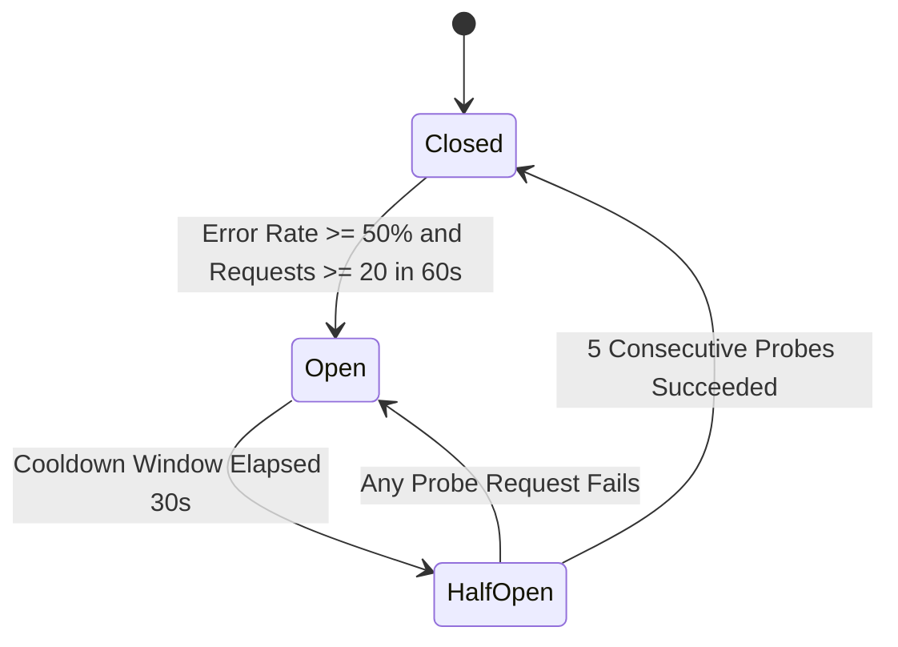
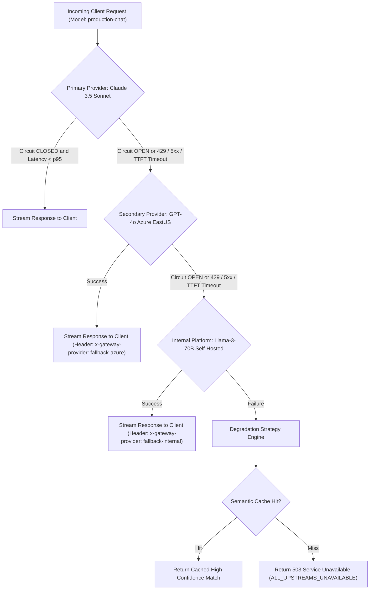

# AI Gateway Failure Modes and Effects Analysis (FMEA) & Resilience Specification

## 1. Executive Summary & Purpose

This document specifies the failure modes, effects, detection mechanisms, and mitigation strategies for the AI Gateway (`ai-gateway`). Following the core principles in `/root/company-project-specs/00-PROJECT-PHILOSOPHY.md` and the architecture in `/root/company-project-specs/01-ai-gateway.md`, the gateway acts as the hardened control plane between internal applications and LLM inference providers.

Because LLM API calls are fundamentally high-latency, variable-cost, streaming-centric, and subject to external provider volatility, conventional HTTP reverse-proxy failure models are insufficient. This specification details exact technical behaviors for provider degradations, internal subsystem crashes, and network partitions, ensuring determinism, tenant isolation, and predictable degradation.

---

## 2. Comprehensive Failure Modes and Effects Analysis (FMEA)

The following matrix categorizes all known failure vectors across the gateway request lifecycle.

| Failure ID | Failure Mode | Severity | Root Causes | Detection Telemetry | Immediate System Effect | Mitigation & Containment Strategy |
| :--- | :--- | :--- | :--- | :--- | :--- | :--- |
| **FM-PRV-01** | Provider 5xx Outage | CRITICAL | Upstream cluster overload, internal model server crash, upstream gateway timeout. | `ai_gateway_requests_total{status=~"50[0234]"}` spike; breaker error counter increment. | User requests fail; upstream latency may spike prior to error return. | Immediate retry with jitter on secondary replica; trip circuit breaker if error rate exceeds threshold; route to fallback provider cascade. |
| **FM-PRV-02** | Provider Network Unreachability | CRITICAL | Connection refused (TCP RST), upstream BGP flap, DNS resolution failure (NXDOMAIN, SERVFAIL). | Instant I/O error (`dial tcp: connection refused`, `lookup: i/o timeout`). | In-flight dispatch fails immediately (<10ms). | Zero-delay switch to alternative endpoint; bypass exponential backoff; mark upstream host unhealthy. |
| **FM-PRV-03** | Provider Rate Limiting (429) | HIGH | Tenant or organization quota exceeded; global TPM/RPM ceiling hit at upstream. | `ai_gateway_upstream_duration_seconds{status="429"}`; `Retry-After` header captured. | Client requests rejected or stalled; retry storm risk. | Parse `Retry-After` header; apply decorrelated jitter backoff; failover to secondary provider quota; update local rate limiter headroom. |
| **FM-PRV-04** | High Latency & Hung Streams | HIGH | Inference queue buildup; GPU memory thrashing; half-open TCP connection; missing `[DONE]` marker. | `ai_gateway_time_to_first_token_seconds` > p99 threshold; chunk read timeout fires. | Gateway connection pools exhaust; downstream client timeouts; memory buffer leak. | Enforce TTFT deadline (10s); enforce inter-chunk stream timeout (5s); enable TCP keepalive probes; hedge request to secondary provider after p95 TTFT. |
| **FM-PRV-05** | Malformed / Truncated Response | MEDIUM | Upstream middleware crash; premature EOF; HTTP chunk boundary corruption; model hallucinating invalid JSON. | JSON schema validation error; SSE parser `ErrUnexpectedEOF`; token counter parse error. | Downstream receives broken payload or hung SSE stream. | Stream interceptor emits standard SSE error frame `event: error` with machine-readable code `UPSTREAM_MALFORMED_STREAM` and closes cleanly; log payload signature for audit. |
| **FM-INT-01** | Redis State Store Outage | HIGH | Redis master crash; network partition; Sentinel failover delay; memory OOM. | Ping probe failure; `ai_gateway_state_store_errors_total` counter; circuit breaker trips. | Distributed rate limits and global token buckets unavailable. | Fallback immediately to local in-memory token bucket scaled to `global_quota / N_active_nodes`; log degradation; preserve security enforcement. |
| **FM-INT-02** | Policy Engine Failure | CRITICAL | OPA / deterministic rule engine panic; corrupted policy bundle; syntax evaluation timeout. | Health probe failure on `/healthz/policy`; evaluation error logs. | Incoming requests cannot be authorized or filtered. | **Fail-Secure (Fail-Closed)**: Reject all unverified requests with HTTP 500 `POLICY_EVALUATION_FAILED`. Never allow bypass of security boundaries. |
| **FM-CLI-01** | Abrupt Client Disconnect | LOW | Client cancels request, network drops, browser tab closed during long streaming output. | Downstream `http.CloseNotifier` / context cancellation (`context.Canceled`). | Orphaning of upstream LLM inference request while tokens continue to generate at direct cost. | Propagate cancellation upstream immediately by cancelling upstream HTTP request context; record consumed tokens up to disconnect point. |
| **FM-CLI-02** | Slow Downstream Consumer | MEDIUM | Client on cellular network reads SSE chunks slower than model token generation rate. | TCP send buffer saturation; write buffer watermark exceeded. | Memory bloat on gateway holding unconsumed token buffers. | Implement bounded client write buffer (64KB); drop or terminate client connection with `CLIENT_WRITE_TIMEOUT` if stalled >15s. |
| **FM-STM-01** | Request Storm / Token Surge | HIGH | Runaway loop in tenant service, load test hitting production, prompt injection expanding tokens. | `ai_gateway_ratelimit_rejections_total` surge; queue depth alert. | Starvation of other tenants; upstream account-wide rate limit exhaustion. | Enforce multi-tier token bucket (RPM and TPM); shed unauthenticated traffic at edge; apply per-tenant concurrency semaphores. |

---

## 3. Deep-Dive Failure Mechanics & Technical Mitigations

### 3.1. Provider Outages (HTTP 500, 502, 503, 504, Connection Refused, DNS Failure)

When an upstream LLM provider fails, the gateway must differentiate between transport-level failures and protocol-level errors.

#### Transport & Network Failures
1. **Connection Refused (TCP RST)**: Indicates the remote port is closed or upstream ingress is down. The gateway intercepts `ECONNREFUSED` immediately without sleeping, marks the host's health check as failing, and re-dispatches the request to the next provider in the routing table.
2. **DNS Resolution Failure**: DNS lookups (`getaddrinfo`) must be performed asynchronously with a strict 500ms timeout. A failure (`NXDOMAIN`, `SERVFAIL`, or timeout) triggers an immediate fallback to a secondary configured provider. The gateway maintains an in-memory DNS cache with a minimum TTL of 15 seconds to ride out transient resolver hiccups, but honors DNS TTL up to 300 seconds.

#### Protocol-Level 5xx Errors
1. **502/503/504 vs 500**:
   - `503 (Service Unavailable)` and `504 (Gateway Timeout)` indicate upstream capacity exhaustion or proxy timeouts. These are transient errors eligible for one immediate hedged retry or fallback cascade.
   - `500 (Internal Server Error)` from an upstream LLM provider often indicates a non-recoverable execution crash for that specific prompt. If a retry to the identical provider fails once, the gateway routes to an alternate model provider with equivalent capabilities.

---

### 3.2. Provider Rate Limiting (HTTP 429) & Backoff Dynamics

When an upstream returns HTTP 429, the gateway prevents thundering herds by executing precise backoff mathematics and header parsing.

#### Header Parsing Sequence
The gateway checks upstream response headers in the following priority order:
1. `Retry-After`: Can be formatted as integer seconds (`Retry-After: 12`) or HTTP-Date format (`Retry-After: Fri, 31 Dec 2026 23:59:59 GMT`).
2. `x-ratelimit-reset-requests` or `x-ratelimit-reset-tokens`: Expressed as relative durations (`250ms`, `2s`) or Unix timestamps.
3. Fallback: If no headers are supplied, the gateway uses internal exponential backoff.

#### Decorrelated Jitter Exponential Backoff Algorithm
To prevent synchronous retries across distributed gateway instances, the retry delay is calculated using the Full Jitter formulation:

$$\text{Sleep} = \text{Uniform}\left(0, \; \min\left(T_{\max}, \; T_{\text{base}} \times 2^{\text{attempt}}\right)\right)$$

Where:
- $T_{\text{base}} = 200\,\text{ms}$
- $T_{\max} = 10{,}000\,\text{ms}$
- $\text{attempt} \in \{0, 1, 2\}$ (maximum 2 retries before tripping fallback)

If `Retry-After` exceeds $5{,}000\,\text{ms}$, the gateway aborts waiting on the current provider and immediately routes the request to the fallback provider in the cascade.

---

### 3.3. High Latency, Slow Providers, and Streaming Integrity

LLM responses are distinct because latency consists of two phases:
1. **Time To First Token (TTFT)**: Time elapsed between sending the request payload and receiving the first SSE chunk or HTTP header.
2. **Time Per Output Token (TPOT) / Inter-chunk Latency**: Time between successive SSE token frames.

```
Client               AI Gateway              Upstream LLM Provider
  |                      |                              |
  |--- POST /chat ------>|                              |
  |                      |--- POST /v1/chat/completions>|
  |                      |                              |
  |                      |<- TTFT Deadline (10s max) ---|
  |                      |<-- First SSE Chunk ----------|
  |<- First Chunk -------|                              |
  |                      |<-- Inter-Chunk (5s max) -----|
  |                      |<-- Next SSE Chunk -----------|
  |<- Next Chunk --------|                              |
  |                      |                              |
  |                      |-- [STREAM HUNG: >5s elapsed]-|
  |                      |-- Abort Context ------------>| (TCP RST)
  |<- event: error ------|                              |
  |   code: STREAM_TIMEOUT                              |
```

#### Dead Socket and Stream Guardrails
- **Connect Timeout**: 2,000ms.
- **TTFT Deadline**: 10,000ms. If no byte is received within 10 seconds, the upstream request context is cancelled, and the request fails over.
- **Inter-Chunk Idle Timeout**: 5,000ms. If a stream starts but stalls for more than 5 seconds between chunks, the gateway terminates the connection, sends an SSE error frame to the client, and records the failure in the circuit breaker.
- **TCP Keepalive**: Socket options are configured as:
  - `SO_KEEPALIVE = 1`
  - `TCP_KEEPIDLE = 30` (seconds before probing)
  - `TCP_KEEPINTVL = 5` (interval between probes)
  - `TCP_KEEPCNT = 3` (dropped after 3 unanswered probes)

---

### 3.4. Malformed Provider Responses

External LLM providers occasionally emit truncated JSON or malformed Server-Sent Events (SSE).

1. **Truncated SSE Streams**: A stream that terminates without sending the standard `data: [DONE]` payload or with an incomplete UTF-8 sequence. The gateway stream parser detects premature TCP FIN packets.
2. **Mitigation**:
   - The gateway maintains a streaming response proxy that buffers chunk delimiters (`\n\n`).
   - If the upstream socket closes prematurely, the gateway does not pass a truncated JSON block to the downstream client as if it succeeded.
   - It emits a structured downstream SSE error block:
     ```text
     event: error
     data: {"error":{"code":"UPSTREAM_STREAM_TRUNCATED","message":"Upstream provider disconnected prematurely before emitting completion token.","recoverable":false}}
     ```
   - The token accounting system logs the exact number of parsed completion tokens generated up to the failure point so tenant billing remains accurate.

---

### 3.5. Gateway Internal Dependency Failures

#### State Store (Redis) Partition / Outage
The gateway relies on Redis for distributed sliding-window rate limiting, token quota reservations, and circuit breaker metrics.
- **Detection**: Redis commands fail with connection timeouts (configured to 50ms deadline) or connection refused.
- **Degraded In-Memory Mode**:
  - The gateway contains an embedded, thread-safe, lock-free local token bucket and sliding window tracker.
  - When Redis becomes unreachable, the node switches to `LOCAL_DEGRADED` state.
  - Each node takes its provisioned tenant limit and divides it by the estimated cluster size:
    $$\text{Local Quota} = \frac{\text{Global Quota}}{N_{\text{gateway\_instances}}}$$
  - A background health prober tests Redis every 1,000ms. Once 3 consecutive `PING` commands return within 10ms, the node resumes distributed state coordination.

#### Policy Engine Failure
The policy engine verifies tenant permissions, model access rights, and data loss prevention (DLP) rules.
- **Enforcement Rule**: **Deterministic Fail-Secure**.
- If the policy engine evaluation crashes, times out, or fails to parse a rule set, the request **must be rejected** with HTTP 500:
  ```json
  {
    "error": {
      "code": "SECURITY_POLICY_EVALUATION_ERROR",
      "message": "Gateway security policy engine unavailable. Request denied under fail-secure policy."
    }
  }
  ```
- Non-security policies (such as optional telemetry tags or non-blocking audit logging) fail open with error logging to prevent service disruption.

---

### 3.6. Client-Side Disconnections and Backpressure

#### Immediate Cancellation Propagation
LLM inference incurs high cost per output token. If a client terminates their HTTP connection mid-generation, continuing upstream generation wastes financial budget and upstream rate limits.
1. The gateway binds the client HTTP request context (`r.Context()`) directly to the upstream HTTP client context.
2. When the downstream TCP connection drops (detected via client socket read EOF or poll `EPOLLRDHUP`), the context is immediately cancelled.
3. The upstream HTTP transport issues a TCP RST / HTTP/2 `RST_STREAM` to the provider.
4. Final token counts are flushed to the audit log with status `CLIENT_CANCELLED`.

#### Slow Consumer Backpressure
When a client reads SSE frames slower than the LLM generates them:
1. The gateway's internal buffer for that client begins to fill.
2. The buffer is capped at **64 KB** (approximately 16,000 tokens).
3. If the buffer fills completely, the gateway pauses reading from the upstream socket, exerting TCP window backpressure on the upstream provider.
4. If the client socket remains unwritable for more than 15 seconds, the gateway terminates the client stream with `CLIENT_WRITE_TIMEOUT`.

---

## 4. Circuit Breaker State Machine

The AI Gateway implements an upstream circuit breaker per provider endpoint (e.g., `openai-eastus-gpt4o`, `anthropic-claude-35-sonnet`). The breaker prevents cascade failures and frees up connection pools when an upstream degrades.

### 4.1. Mathematical State Transition Triggers



#### States and Formal Definitions

1. **CLOSED State**:
   - Normal operation. All traffic routed to upstream provider.
   - Failures and successes are tracked in a 60-second sliding time window divided into 1-second buckets.
   - **Trip Condition**:
     $$\frac{N_{\text{failure}}}{N_{\text{total}}} \ge E_{\text{threshold}} \quad \text{AND} \quad N_{\text{total}} \ge N_{\min}$$
     Where:
     - $E_{\text{threshold}} = 0.50$ (50% failure rate)
     - $N_{\min} = 20$ requests in the 60-second window
     - Failures include: HTTP 5xx, transport errors, connection timeouts, and TTFT deadline expirations. HTTP 4xx (except 429) do not count as upstream failures.

2. **OPEN State**:
   - Short-circuit state. No production traffic is dispatched to the upstream provider.
   - Incoming requests immediately route to the next configured fallback in the cascade (or return `UPSTREAM_CIRCUIT_OPEN` if no fallback exists).
   - Duration: The breaker remains OPEN for a cooldown duration $T_{\text{cooldown}} = 30\,\text{seconds}$.

3. **HALF-OPEN State**:
   - Canary evaluation state entered after $T_{\text{cooldown}}$ expires.
   - Production traffic remains diverted, except for a constrained canary stream: exactly **1 request at a time** (or 2% of total traffic, up to max 2 concurrent probes).
   - **Recovery Condition**: If $P_{\text{success}} = 5$ consecutive probe requests succeed with HTTP 200 and TTFT < 5,000ms, the breaker transitions to **CLOSED**.
   - **Re-trip Condition**: If any single probe request fails ($P_{\text{fail}} \ge 1$), the breaker immediately returns to **OPEN**, doubling the cooldown window:
     $$T_{\text{cooldown\_next}} = \min(300\,\text{s}, \; T_{\text{cooldown}} \times 2)$$

---

## 5. Adaptive Fallback Cascades & Degradation Strategies

When a provider is degraded or its circuit breaker is OPEN, the gateway executes deterministic fallback cascades.

### 5.1. Explicit Failover Tree

Routing decisions are declared explicitly in configuration, avoiding opaque or non-deterministic heuristics.



### 5.2. Speculative Hedging Strategy

For latency-critical applications (such as real-time user-facing autocomplete or voice agents), the gateway supports **Speculative Request Hedging**:

1. Request is dispatched to the Primary Provider.
2. The gateway schedules a timer set to the provider's rolling **p95 TTFT** (e.g., 1,200ms).
3. If the primary provider has not returned its first SSE chunk before the timer fires:
   - The gateway dispatches an identical speculative request to the Secondary Provider.
4. **First-Token Arbitration**: Whichever provider yields the first valid SSE chunk wins the arbitration race.
5. The gateway cancels the slower provider's context immediately to abort further execution and avoid unnecessary token consumption.
6. Hedging is restricted to idempotency-safe requests and disabled if tenant token budget is within 10% of monthly exhaustion.

### 5.3. Graceful Degradation Tiers

When upstream infrastructure experiences widespread failure, the gateway applies layered degradation:

1. **Tier 1: Model Substitution**: Route to equivalent tier model across distinct cloud providers (e.g., Anthropic $\rightarrow$ Azure OpenAI $\rightarrow$ AWS Bedrock).
2. **Tier 2: Context Compression**: If downstream models have narrower context windows or upstream 429s are caused by high TPM (tokens per minute), the gateway truncates intermediate chat history while preserving the system prompt and latest user turn.
3. **Tier 3: Feature Shedding**: If tool calling or structured JSON mode causes upstream provider schema generation errors, the gateway strips non-essential tools and falls back to raw text completion.
4. **Tier 4: Semantic Cache Serve**: Return cached responses for identical prompts if stored within TTL (default 24 hours), tagged with header `X-Cache-Lookup: HIT-STALE`.
5. **Tier 5: Clean Synthetic Failure**: If all upstream options fail, return a structured, deterministic JSON error:
   ```json
   {
     "error": {
       "code": "PROVIDER_EXHAUSTION_CASCADE_FAILED",
       "message": "All upstream model providers in the fallback cascade are currently unavailable.",
       "cascade_trace": [
         {"provider": "anthropic-claude", "error": "CIRCUIT_BREAKER_OPEN"},
         {"provider": "azure-gpt4o", "error": "HTTP_503_UPSTREAM_OVERLOAD"},
         {"provider": "internal-llama3", "error": "DIAL_TIMEOUT_2000MS"}
       ]
     }
   }
   ```
