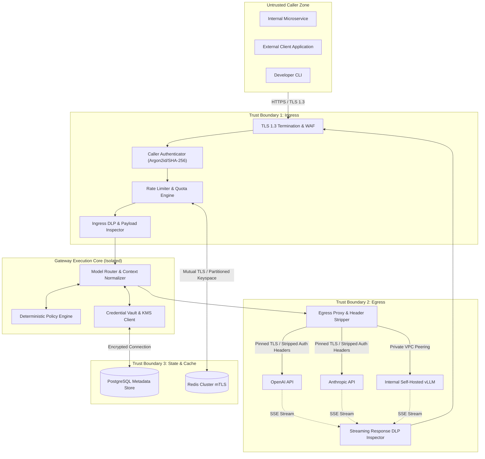
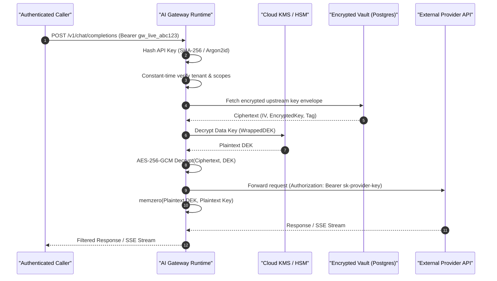

# Security Boundaries and Enforcement Architecture

## Status
Living Technical Specification / Production Standard

## Domain
AI Infrastructure / Application Security / Platform Engineering

## Architectural Thesis
The AI Gateway acts as an authoritative, deterministic security perimeter separating untrusted callers, internal state storage, and external AI model providers. 

In accordance with the project philosophy:
> AI proposes. Deterministic systems enforce.

The gateway rejects probabilistic security mechanisms in favor of mathematically verifiable, deterministic controls. Security policies, authorization decisions, tenant isolation boundaries, and data loss prevention (DLP) engines execute through compiled automata, cryptographic verification, and linear-time algorithms.

## Related Specifications and Architecture Documents
- Foundational Philosophy: [00-PROJECT-PHILOSOPHY.md](file:///root/company-project-specs/00-PROJECT-PHILOSOPHY.md)
- System Specification: [01-ai-gateway.md](file:///root/company-project-specs/01-ai-gateway.md)
- Threat Model and STRIDE Analysis: [THREAT-MODEL.md](file:///root/ai-gateway/docs/THREAT-MODEL.md)
- Architecture Decision Record: [ADR-004: Streaming Policy Enforcement](file:///root/ai-gateway/docs/adr/ADR-004-streaming-policy-enforcement.md)

---

## 1. Core Security Principles

```
+---------------------------------------------------------------------------------------+
|                                    ZERO TRUST PERIMETER                               |
|                                                                                       |
|  +------------------------+   +------------------------+   +-----------------------+  |
|  |   Caller Authentication|   |   Deterministic Policy |   |    Upstream Egress    |  |
|  |  - Ephemeral tokens    |   |  - Non-probabilistic   |   |  - Stripped headers   |  |
|  |  - Argon2id / SHA-256  |-->|  - Linear-time RE2     |-->|  - KMS Vaulted keys   |  |
|  |  - Constant-time match |   |  - Shannon Entropy     |   |  - Ephemeral buffers  |  |
|  +------------------------+   +------------------------+   +-----------------------+  |
|               |                            |                            |             |
|               v                            v                            v             |
|  +---------------------------------------------------------------------------------+  |
|  |                             SAFE FAILURE DEFAULTS                               |  |
|  |   State failure: Reject request | Engine timeout: Fail-closed | Zero data leak  |  |
|  +---------------------------------------------------------------------------------+  |
+---------------------------------------------------------------------------------------+
```

### 1.1 Zero Trust
Implicit trust is strictly prohibited across all network segments. 
- Every incoming HTTP request must be authenticated, authorized, and validated regardless of whether it originates from an internal microservice, VPC peering connection, or external public endpoint.
- Network location does not confer authorization. Mutual TLS (mTLS) with modern cipher suites (TLS 1.3 only) is required for east-west service traffic.
- Upstream AI model providers (OpenAI, Anthropic, Google Vertex AI, AWS Bedrock) are treated as untrusted external processors. Responses are subjected to the same ingress validation, DLP inspection, and policy enforcement as client requests.

### 1.2 Deterministic Policy Enforcement
The security critical path never delegates enforcement decisions to an LLM or probabilistic classifier.
- Classifiers can be evaded via adversarial token perturbation, linguistic obfuscation, and prompt injection.
- Security boundaries are enforced via deterministic primitives:
  - Compiled regular expressions with guaranteed $O(n)$ linear-time execution (RE2 automaton syntax).
  - Mathematical Shannon entropy analysis with strict numerical thresholds.
  - Finite state machines (FSM) for streaming token sequence analysis.
  - Cryptographic validation of tenant identifiers and capability scopes.

### 1.3 Least Privilege
Access rights are strictly minimized across all tiers:
- **Tenant Scope:** API keys are bound to a single tenant namespace, specific model endpoints, strict requests-per-minute (RPM) rates, and token quotas.
- **Gateway Runtime:** Gateway container processes run as unprivileged users (`uid=10001, gid=10001`) with read-only root filesystems, dropped Linux capabilities (`CAP_DROP_ALL`), and no access to host Docker sockets or cloud instance metadata endpoints (`169.254.169.254` blocked via iptables/eBPF).
- **Upstream Key Scope:** Upstream API keys stored in the gateway vault are locked to project-level or model-family scopes rather than administrative master keys.

### 1.4 Safe Failure Defaults (Fail-Closed Architecture)
When an internal subsystem, backing store, or policy engine fails or exceeds its execution deadline, the gateway defaults to denying the transaction.

| Subsystem Component | Failure Mode | Default Action | Error Response to Caller | Audit Logging Action |
| :--- | :--- | :--- | :--- | :--- |
| **State Store (Redis/Postgres)** | Connection refused or network partition | **FAIL-CLOSED**: Deny request immediately | `503 Service Unavailable` (`STATE_STORE_UNAVAILABLE`) | Log critical system alert with error signature |
| **DLP / Regex Engine** | Processing deadline exceeded ($t > 50\text{ms}$) | **FAIL-CLOSED**: Drop payload and terminate stream | `500 Internal Error` (`POLICY_EVALUATION_TIMEOUT`) | Record raw hash and timeout violation |
| **KMS / Secret Vault** | KMS decryption API timeout or rate limited | **FAIL-CLOSED**: Refuse model egress | `503 Service Unavailable` (`UPSTREAM_CREDENTIAL_UNAVAILABLE`) | Emit high-severity security alert |
| **Upstream Provider** | Malformed HTTP chunks or invalid SSE frame | **FAIL-CLOSED**: Abort connection, discard buffer | `502 Bad Gateway` (`UPSTREAM_PROTOCOL_VIOLATION`) | Record provider signature mismatch |
| **Tenant Rate Limiter** | Redis sliding window counter timeout | **FAIL-CLOSED**: Reject request | `429 Too Many Requests` (`RATE_LIMIT_BACKEND_FAILURE`) | Record rate limit check failure |

*Exception:* An explicit tenant configuration may override DLP scanning to `FAIL-OPEN` only for non-regulated developer test environments. Production tenants bound by PCI-DSS, HIPAA, or SOC 2 are permanently locked to `FAIL-CLOSED`.

---

## 2. Trust Boundaries and Threat Surfaces



### 2.1 Boundary 1: Client-to-Gateway (Ingress Perimeter)
- **Interface:** Public or internal VPC HTTPS endpoints exposing `/v1/chat/completions`, `/v1/models`, and `/v1/embeddings`.
- **Threat Surface:** Unauthenticated requests, credential stuffing, malformed JSON bodies, Slowloris HTTP attacks, ReDoS payloads, header spoofing (`X-Forwarded-For`, `Host`), and prompt injection attempts.
- **Enforcement Mechanisms:**
  1. **Transport Security:** TLS 1.3 strictly enforced. Supported cipher suites:
     - `TLS_AES_256_GCM_SHA384`
     - `TLS_CHACHA20_POLY1305_SHA256`
     - Legacy TLS 1.0, 1.1, and 1.2 are rejected at the edge listener.
  2. **Caller Identity Verification:** API keys presented via `Authorization: Bearer gw_<env>_<key_id>_<secret>` header. Constant-time verification against cryptographic salted hashes prevents timing attacks.
  3. **Strict Ingress Constraints:**
     - Maximum request body size: 10 MB (enforced before body parsing).
     - JSON parsing limits: Maximum nesting depth of 32 levels to prevent stack exhaustion.
     - HTTP request read timeout: 5 seconds for complete header ingestion.

### 2.2 Boundary 2: Gateway-to-Upstream Provider (Egress Perimeter)
- **Interface:** External HTTPS connections to third-party model APIs or internal private endpoints.
- **Threat Surface:** Exposure of upstream provider credentials to callers, Server-Side Request Forgery (SSRF) via rogue routing rules, response poisoning, malicious tool-call injection, and data exfiltration through model completions.
- **Enforcement Mechanisms:**
  1. **Header Stripping and Sanitization:** All incoming caller HTTP headers (including `Cookie`, `X-Forwarded-For`, `Authorization`, and custom vendor headers) are stripped prior to egress forwarding.
  2. **Dynamic Credential Injection:** Upstream provider API keys (`sk-...`, `Bearer ...`) are fetched from encrypted memory cache and injected into the egress request header right before socket transmission. They are never mirrored back into response bodies or debug logs.
  3. **Egress Isolation:** The gateway connects to external providers through a dedicated egress gateway or NAT IP pool. Direct outbound connectivity to arbitrary external IP addresses is denied by network policy; egress is strictly allowlisted to verified provider FQDNs (`api.openai.com`, `api.anthropic.com`, etc.).
  4. **Strict Certificate Pinning:** Egress requests validate upstream CA trust roots against a minimal, hardened root bundle.

### 2.3 Boundary 3: Gateway-to-StateStore (Control and State Boundary)
- **Interface:** High-throughput network connections to Redis (rate limiting, sliding window token counters, idempotency cache) and PostgreSQL (tenant metadata, audit logs, encrypted key vault).
- **Threat Surface:** Redis command injection, unauthorized cross-tenant key access, data persistence leakage, denial of service via memory exhaustion.
- **Enforcement Mechanisms:**
  1. **Network Encryption:** Mutual TLS (mTLS) with client certificates required for all state store connections. Cleartext TCP connections are disabled.
  2. **Keyspace Isolation:** Commands are executed through parameterized client drivers. Direct raw string interpolation of Redis commands is prohibited.
  3. **Zero Payload Persistence:** The state store explicitly prohibits storage of raw prompt text or model completion output. Only cryptographic digests (SHA-256 hashes), token counts, timestamps, and tenant identifiers may be persisted in Redis.

---

## 3. Tenant Isolation Architecture

In a multi-tenant environment, tenant isolation guarantees that no tenant can read, modify, or infer data belonging to another tenant under any failure mode or concurrency state.

```
+-----------------------------------------------------------------------------+
|                                TENANT NAMESPACE                             |
|                                                                             |
|   Tenant A Request                                                          |
|   +---------------------------------------------------------------------+   |
|   | Tenant ID: "ten_01HXYZ" (Validated from Key Digest)                 |   |
|   | HKDF Key:  K_A = HKDF-Expand(RootKey, "ten_01HXYZ", 32)             |   |
|   | Cache Key: SHA-256("ten_01HXYZ" || model || prompt_canonical_hash)   |   |
|   | Redis Key: "ratelimit:ten_01HXYZ:window_60"                         |   |
|   +---------------------------------------------------------------------+   |
|                                                                             |
|   Tenant B Request                                                          |
|   +---------------------------------------------------------------------+   |
|   | Tenant ID: "ten_02JKLM" (Validated from Key Digest)                 |   |
|   | HKDF Key:  K_B = HKDF-Expand(RootKey, "ten_02JKLM", 32)             |   |
|   | Cache Key: SHA-256("ten_02JKLM" || model || prompt_canonical_hash)   |   |
|   | Redis Key: "ratelimit:ten_02JKLM:window_60"                         |   |
|   +---------------------------------------------------------------------+   |
|                                                                             |
|   CRYPTOGRAPHIC SEPARATION: K_A != K_B (Zero Cross-Tenant Leakage)         |
+-----------------------------------------------------------------------------+
```

### 3.1 Cryptographic Tenant Partitioning
Tenant identifiers (`tenant_id`) are immutable UUIDv7 or prefixed KSUIDs derived during caller authentication.
- **Envelope Encryption per Tenant:** Secret materials and configurations are encrypted with unique Tenant Data Keys ($TDK$).
- **Key Derivation Function:** When tenant-specific keys are required, they are derived using HMAC-based Key Derivation Function (HKDF, RFC 5869):
  $$TDK = \text{HKDF-Expand}(\text{Extract}(Salt, RootKey), \text{"tenant:"} \parallel tenant\_id, 32)$$
  Even if an adversary compromises memory holding one tenant's derived key, they gain no mathematical advantage in deriving keys for any other tenant.

### 3.2 Namespace Isolation in Shared Data Stores
1. **Redis Key Prefixing:**
   Every Redis key is strictly prefixed with the authenticated tenant identifier:
   ```text
   ratelimit:{tenant_id}:{model_group}:{window_timestamp}
   tokens:{tenant_id}:{billing_cycle}
   idempotency:{tenant_id}:{request_fingerprint}
   ```
2. **Relational Database Row-Level Security (RLS):**
   In PostgreSQL, tenant isolation is enforced at the database engine level via Row-Level Security:
   ```sql
   ALTER TABLE tenant_api_keys ENABLE ROW LEVEL SECURITY;
   CREATE POLICY tenant_isolation_policy ON tenant_api_keys
       FOR ALL
       USING (tenant_id = current_setting('app.current_tenant_id', true));
   ```
   Every database connection checkout executes `SET LOCAL app.current_tenant_id = '...'` within the active transaction before any queries can execute.

### 3.3 Prevention of Cross-Tenant Data Leakage
- **Cache Poisoning and Collision Resistance:**
  If semantic or exact caching is enabled, the cache lookup key must incorporate the tenant identifier in its pre-image:
  $$\text{CacheKey} = \text{SHA-256}(tenant\_id \parallel \text{":"} \parallel model \parallel \text{":"} \parallel \text{CanonicalPromptJSON})$$
  Two distinct tenants sending identical prompts receive distinct cache keys. Tenant A can never read Tenant B's cached response, eliminating cache probing side-channels.
- **Runtime Memory Boundary Sanitization:**
  - Memory buffers allocated for request decoding and response streaming are zeroed out (`memzero` / `Zeroize`) upon stream termination or connection closure.
  - Connection pooling backends purge thread-local storage and request context structures before returning socket connections to the pool.

---

## 4. Credential Lifecycle and Upstream Key Vaulting



### 4.1 Caller Authentication Mechanism
Callers authenticate using high-entropy API keys issued by the gateway control plane.
- **Key Structure:** `gw_<env>_<key_identifier>_<key_secret>`
  - `gw`: Standard fixed prefix (3 characters)
  - `<env>`: Target environment (`live`, `test`, `dev`)
  - `<key_identifier>`: 12-character public routing identifier (used for database indexed lookup)
  - `<key_secret>`: 32-character high-entropy secret string generated by a cryptographically secure pseudorandom number generator (CSPRNG) with at least 192 bits of entropy.
- **Storage and Verification:**
  - Raw secret strings are **never stored**.
  - Database stores:
    - Key Identifier (indexed lookup).
    - Salt: 32 bytes CSPRNG.
    - Hash: Argon2id (parameters: $m=65536\text{ KiB}, t=3\text{ iterations}, p=4\text{ threads}$) or high-throughput salted SHA-256 for latency-critical paths:
      $$\text{StoredHash} = \text{SHA-256}(Salt \parallel key\_secret)$$
  - Authentication performs constant-time comparison (`crypto/subtle.ConstantTimeCompare`) over the fixed-length digests to eliminate timing side-channels.

### 4.2 Upstream Provider Key Vaulting and Encryption at Rest
External provider keys (`OPENAI_API_KEY`, `ANTHROPIC_API_KEY`) are managed under an envelope encryption scheme:
1. **Root Key ($KEK$):** Maintained exclusively inside Cloud KMS (AWS KMS, GCP KMS, or Vault HSM). The raw key encryption key never leaves the physical HSM.
2. **Data Encryption Key ($DEK$):** Generated randomly per tenant credential bundle.
3. **Payload Encryption:** Provider credentials are encrypted using **AES-256-GCM** (authenticated encryption with associated data):
   - **Key:** 256-bit DEK.
   - **Initialization Vector (IV):** 96-bit unique nonce generated via CSPRNG for every encryption operation. Reusing an IV with the same DEK is mathematically prevented.
   - **Associated Data (AAD):** Bound to the `tenant_id` and `provider_name` strings. Any attempt to transplant a ciphertext from one tenant to another causes authentication tag validation failure.
   - **Auth Tag:** 128-bit authentication tag verified prior to decryption.

### 4.3 In-Memory Lifecycle and Key Destruction
- Plaintext provider keys are decrypted into ephemeral byte slices strictly at the point of egress dispatch.
- Keys are wrapped in memory-safe containers implementing immediate zeroization (`Zeroize` in Rust, `crypto/subtle` memory wiping in Go) upon request completion.
- Debug dumps, stack traces, and uncaught exception handlers hook into formatting sanitizers to scrub all patterns matching `sk-[a-zA-Z0-9]{32,}` and Bearer tokens.
- Linux `mlock()` is utilized where supported to prevent decrypted key pages from being paged out to unencrypted swap memory.

---

## 5. Deterministic Data Loss Prevention (DLP) and Policy Engine

The Data Loss Prevention engine runs on both ingress (client prompts) and egress (model completions) to detect and block or redact sensitive data.

### 5.1 Deterministic Scanners
The DLP pipeline executes two complementary, strictly non-probabilistic scanning engines:

#### 1. Linear-Time Regular Expression Automata (RE2)
To completely prevent Regular Expression Denial of Service (ReDoS), the gateway permits only deterministic finite automata (DFA) engines guaranteeing $O(n)$ search time across payload length $n$.

| Target Sensitive Data | Deterministic Detection Pattern | Validation Algorithm / Checksum |
| :--- | :--- | :--- |
| **Credit Cards (PCI-DSS)** | `\b(?:4[0-9]{12}(?:[0-9]{3})?\|5[1-5][0-9]{14}\|3[47][0-9]{13})\b` | **Luhn Checksum ($Mod\ 10$)**: Strips delimiters and verifies double-add parity. |
| **US Social Security No.** | `\b(?!000\|666\|9[0-9]{2})[0-9]{3}-(?!00)[0-9]{2}-(?!0000)[0-9]{4}\b` | Area/Group/Serial range validation |
| **AWS Access Key ID** | `\b(AKIA\|ASIA\|AROA\|AIPA)[A-Z0-9]{16}\b` | Length check and prefix verification |
| **GCP API Key** | `\bAIza[0-9A-Za-z\-_]{35}\b` | Character set and length verification |
| **Private Keys (PEM)** | `-----BEGIN (?:RSA\|EC\|DSA\|OPENSSH\|PRIVATE) KEY-----` | Header and footer boundary validation |
| **JSON Web Tokens (JWT)** | `\beyJ[A-Za-z0-9\-_=]+\.[A-Za-z0-9\-_=]+\.[A-Za-z0-9\-_=]+\b` | Base64 URL character validation |

#### 2. Shannon Entropy Scanner
High-entropy strings representing obfuscated tokens, custom API keys, or raw encrypted binary are detected using Shannon's information entropy formula:
$$H(X) = -\sum_{i=1}^{n} P(x_i) \log_2 P(x_i)$$
Where:
- $X$ is a candidate token of length $L \ge 20$ characters without whitespace.
- $P(x_i)$ is the frequency of character $x_i$ within the token.

**Detection Rules:**
- Base64 encoded secrets ($L \ge 32$): Threshold $H(X) \ge 4.5$ bits/symbol.
- Hexadecimal strings ($L \ge 32$): Threshold $H(X) \ge 3.5$ bits/symbol.
- Any token exceeding the threshold triggers the configured DLP action.

### 5.2 Policy Execution Pipeline
```
Raw Payload Input
       |
       v
+-----------------------------+
| Tokenizer / Lexer Boundary  |
+-----------------------------+
       |
       v
+-----------------------------+
| RE2 Deterministic Automaton | ---> Pattern Match Found? 
+-----------------------------+          |
       | No                              | Yes
       v                                 v
+-----------------------------+   +-------------------------------+
| Shannon Entropy Analyzer    |   | Execute Configured DLP Action |
+-----------------------------+   +-------------------------------+
       |                                 |
       | Entropy > Threshold?            |-- BLOCK: Terminate with HTTP 400
       |                                 |-- REDACT: Substitute with [REDACTED_TYPE]
       +--- Yes ------------------------>|-- WARN: Attach X-Policy-Warning header
       |                                 |-- AUDIT_ONLY: Emit security event
       +--- No (Payload Clean) ---------> Proceed to Next Gateway Stage
```

### 5.3 Policy Action Modes
1. **BLOCK (Default):** The request is rejected immediately with HTTP `400 Bad Request`. The response body specifies the matched rule name without echoing back the offending data snippet:
   ```json
   {
     "error": {
       "type": "policy_violation",
       "code": "DLP_SENSITIVE_DATA_DETECTED",
       "rule": "PCI_CREDIT_CARD",
       "message": "Transaction rejected: sensitive payment card information identified in request body."
     }
   }
   ```
2. **REDACT:** The matching byte sequence is masked with a constant token replacement before forwarding (e.g. `[REDACTED_SSN]`, `[REDACTED_AWS_KEY]`).
3. **WARN:** The transaction proceeds, but an egress header `X-Security-Warning: DLP_MATCH_<RULE>` is appended.
4. **AUDIT_ONLY:** The transaction proceeds unmodified; a high-priority alert is emitted directly to the tamper-evident audit log.

---

## 6. Audit Trail and Tamper Evidence

To satisfy legal non-repudiation and enterprise compliance, the gateway writes structured, cryptographically authenticated audit events.

```
+-----------------------------------------------------------------------------------------+
|                               CRYPTOGRAPHIC AUDIT CHAIN                                 |
|                                                                                         |
|  Entry i-1                                                                              |
|  +-----------------------------------------------------------------------------------+  |
|  | Seq: 1042 | Timestamp: 2026-09-22T02:18:00Z | PayloadHash: "e3b0c442..."          |  |
|  | PrevHash: "a1b2c3d4..." | CurrentHash: SHA-256(PrevHash || Entry_1042)            |  |
|  +-----------------------------------------------------------------------------------+  |
|                                              |                                          |
|                                              v (Chained)                                |
|  Entry i                                                                                |
|  +-----------------------------------------------------------------------------------+  |
|  | Seq: 1043 | Timestamp: 2026-09-22T02:18:01Z | PayloadHash: "8f4b231a..."          |  |
|  | PrevHash: SHA-256(PrevHash || Entry_1042)                                         |  |
|  | CurrentHash: SHA-256(PrevHash || Entry_1043)                                         |  |
|  +-----------------------------------------------------------------------------------+  |
|                                              |                                          |
|                                              v (Chained)                                |
|  Entry i+1                                                                              |
|  +-----------------------------------------------------------------------------------+  |
|  | Seq: 1044 | Timestamp: 2026-09-22T02:18:02Z | PayloadHash: "4c3b2a10..."          |  |
|  +-----------------------------------------------------------------------------------+  |
+-----------------------------------------------------------------------------------------+
```

### 6.1 Structured JSON Audit Log Schema
Audit records are emitted as immutable, single-line JSON records formatted according to RFC 3339:
```json
{
  "$schema": "https://specs.internal.net/schemas/gateway-audit-v1.json",
  "audit_version": "1.0.0",
  "event_id": "01J8F2Z1K0X9B7N2E5M1P8W3V4",
  "sequence_number": 1043,
  "timestamp": "2026-09-22T02:18:01.402851Z",
  "tenant_id": "ten_prod_enterprise_01",
  "key_identifier": "gw_live_k92m",
  "client_ip_hash": "6b86b273ff34fce19d6b804eff5a3f5747ada4eaa22f1d49c01e52ddb7875b4b",
  "route": "/v1/chat/completions",
  "model_requested": "claude-3-5-sonnet-20241022",
  "model_routed": "claude-3-5-sonnet-20241022",
  "provider": "anthropic",
  "policy_verdict": "ALLOW",
  "dlp_matches": [],
  "tokens_prompt": 1284,
  "tokens_completion": 412,
  "duration_ms": 1420.5,
  "ttft_ms": 194.2,
  "request_payload_sha256": "8f4b231a54b37d9b93510b19659b43968600d8bc33e8a4a58434a99d0e14db0b",
  "response_payload_sha256": "3a7bd3e2360a3d29eea436fcfb7e44c735d117c42d1c1835420b6b9942dd4f1b",
  "previous_record_hash": "5e884898da28047151d0e56f8dc6292773603d0d6aabbdd62a11ef721d1542d8",
  "record_hash": "2c26b46b68ffc68ff99b453c1d30413413422d706483bfa0f98a5e886266e7ae"
}
```

### 6.2 Cryptographic Hash Chaining
Logs are protected against post-incident tampering and truncation through a SHA-256 linear hash chain:
$$H_i = \text{SHA-256}(H_{i-1} \parallel \text{CanonicalJSON}(E_i))$$
- **Genesis Block:** At node startup or log rotation, $H_0$ is initialized with the SHA-256 signature of the instance launch attestation document and KMS timestamp.
- **Checkpointing:** Every 10,000 records or 60 seconds (whichever occurs first), the current leaf hash $H_i$ is signed with the gateway's private asymmetric key (Ed25519) and flushed to an append-only, WORM-compliant storage sink (AWS S3 Object Lock in Compliance Mode or GCP Cloud Storage Bucket Lock).
- **Tamper Verification:** Any modification, deletion, or re-ordering of log records breaks the mathematical equality $H_k \ne \text{SHA-256}(H_{k-1} \parallel E_k)$ and triggers an immediate compliance integrity alarm.

### 6.3 Audit Event Sanitization (Zero PII in Logs)
Under no circumstances are raw prompt strings, completions, or unhashed API credentials recorded in log outputs.
- **IP Address Privacy:** Caller IP addresses are anonymized via truncated salted hashing:
  $$\text{ClientIPHash} = \text{SHA-256}(\text{DailyRotatingSalt} \parallel \text{CallerIP})$$
- **Payload Minimization:** The gateway records strictly the SHA-256 digest of the canonicalized input and output bodies. If a post-incident investigation requires verifying whether a specific prompt was submitted, the external auditor hashes the candidate prompt and compares the digest against the tamper-evident log record.
- **Header Scrubbing:** HTTP headers (`Authorization`, `X-Api-Key`, `Cookie`, `Set-Cookie`, `Proxy-Authorization`) are scrubbed before reaching the logging subsystem.
