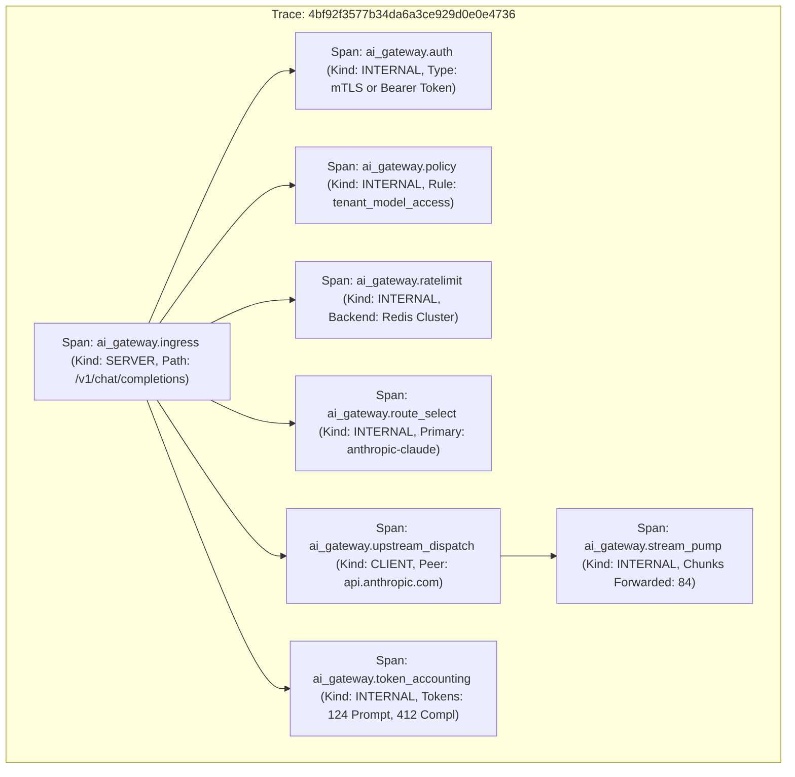

# AI Gateway Service Level Objectives (SLO) & Observability Specification

## 1. Context and Architectural Boundaries

According to `/root/company-project-specs/00-PROJECT-PHILOSOPHY.md`, reliable systems require measurable behavior over claims, and SLOs must be defined before optimization. In the AI Gateway (`ai-gateway`), measuring proxy quality requires strict separation between:
1. **Gateway Overhead Latency**: The computational and network overhead introduced solely by the gateway control plane (authentication, rate limiting, routing, policy evaluation, connection pooling, and stream chunk forwarding).
2. **Upstream Inference Latency**: The variable duration spent by upstream model servers executing token generation (TTFT and completion token generation).

Because LLM generation duration depends on prompt length, model parameter size, completion tokens, and external provider GPU queue depths (varying from 300ms to over 60 seconds), conflating upstream latency with gateway proxy latency destroys observability. A 10x regression in gateway overhead (e.g., from 1ms to 10ms) would remain completely invisible inside a 15,000ms model completion time, yet would degrade gateway throughput and node scalability.

```
+-----------------------------------------------------------------------------------------------+
| Total Client Request Duration (ai_gateway_request_duration_seconds)                          |
+-----------------------------------------------------------------------------------------------+
| Gateway Ingress  | Upstream Inference & Generation Duration               | Gateway Egress    |
| Overhead (T_in)  | (ai_gateway_upstream_duration_seconds)                 | Overhead (T_out)  |
| [Auth, Rate Lim, |                                                        | [Token Counting,  |
| Routing, Policy] | [TTFT Phase]        | [Streaming Token Phase]          | Audit Logging]    |
+------------------+---------------------+----------------------------------+-------------------+
|<--- <2ms (p50) ->|<-- Upstream Queue ->|<-- Token Delays (TPOT * tokens) >|<--- <1ms -------->|
|<------------------------ Gateway Overhead Budget: T_in + T_out < 15ms (p99) ----------------->|
```

---

## 2. Service Level Indicators (SLIs) and Objectives (SLOs)

### 2.1. Gateway Overhead Latency SLO

The Gateway Overhead Latency measures total transit time spent within the gateway process pipeline, calculated as:

$$T_{\text{overhead}} = T_{\text{total\_client}} - T_{\text{upstream\_io}}$$

#### Objectives (30-day rolling window)
- **p50 (Median)**: $< 2.0\,\text{ms}$
- **p95**: $< 8.0\,\text{ms}$
- **p99**: $< 15.0\,\text{ms}$

#### SLI Formula
$$\text{SLI}_{\text{overhead}} = \frac{\sum \text{Requests with } T_{\text{overhead}} \le 15.0\,\text{ms}}{\sum \text{Total Evaluated Requests}} \ge 99.0\%$$

*Measurement Condition*: Evaluated across all non-rejected HTTP/gRPC requests, excluding time spent waiting for client socket reads/writes.

---

### 2.2. Gateway Availability SLO

The availability objective measures the gateway's ability to successfully dispatch valid requests to healthy upstreams without internal proxy crashes or unhandled gateway errors.

#### Objective (30-day rolling window)
- **Availability Target**: **99.95%** (Allowable error budget: 0.05% or 500 PPM)

#### SLI Definition & Boundary Classification
$$\text{SLI}_{\text{avail}} = \frac{\sum \text{Requests}_{\text{gateway\_success}}}{\sum \text{Requests}_{\text{valid}}}$$

Where:
- **Valid Requests ($\text{Requests}_{\text{valid}}$)**: All incoming requests excluding downstream client errors (HTTP 400 Bad Request syntax, 401 Unauthorized API key, 404 Route Not Found, and 429 Tenant Rate Limit Exceeded).
- **Gateway Success ($\text{Requests}_{\text{gateway\_success}}$)**:
  1. Requests where an upstream provider returned HTTP 2xx.
  2. Requests where an upstream provider returned 5xx/429/timeout, but the gateway successfully executed a fallback cascade to an alternate provider resulting in HTTP 2xx.
  3. Requests where all upstream providers failed, and the gateway correctly intercepted the failure, recorded circuit breaker metrics, and emitted a structured synthetic error response without crashing.
- **Gateway Failure ($\text{Requests}_{\text{gateway\_failure}}$)**:
  1. Any HTTP 500 generated by internal gateway faults (panic, memory exhaustion, deadlock).
  2. Any HTTP 502/503/504 generated directly by the gateway due to internal timeout, connection pool exhaustion, or internal state store failure.
  3. Requests dropped mid-stream due to internal buffer overflow or unhandled proxy exceptions.

---

### 2.3. Upstream LLM Inference SLIs (Informational / Provider SLA Monitoring)

Upstream model latency is tracked as an operational indicator per provider and model, but is decoupled from gateway infrastructure performance:

| Indicator | Metric Formula | Target / Expectation |
| :--- | :--- | :--- |
| **Time To First Token (TTFT)** | Duration from upstream socket connect to receipt of byte 1 of chunk 1 | p95 $< 2{,}500\,\text{ms}$ (Claude 3.5 Sonnet / GPT-4o) |
| **Time Per Output Token (TPOT)** | Stream duration divided by completion token count | p95 $< 40\,\text{ms}/\text{token}$ |
| **Provider Availability** | $\frac{N_{2\text{xx}}}{N_{\text{total\_dispatched}}}$ per upstream endpoint | Baseline per provider SLA (e.g. 99.9%) |

---

## 3. Error Budget Policy & Multi-Window Multi-Burn-Rate Alerting

With a 99.95% Availability SLO over a 30-day rolling window:
- Total Error Budget: $100\% - 99.95\% = 0.05\%$
- Number of allowable failed requests: 1 in 2,000 valid requests.

To detect incidents rapidly without triggering false-positive pages on transient spikes, the gateway adheres to Google SRE multi-window multi-burn-rate alerting rules.

### 3.1. Multi-Window Multi-Burn-Rate Alerting Matrix

A burn rate of $1.0\times$ consumes exactly 100% of the error budget over 30 days. Higher burn rates consume the budget faster and require higher alerting urgency.

| Alert Name | Severity | Burn Rate | % Budget Consumed | Long Window | Short Window | Action Required |
| :--- | :--- | :--- | :--- | :--- | :--- | :--- |
| **Page-1Hour-Critical** | CRITICAL (Page) | $14.4\times$ | 2.0% in 1 hour | 1 hour | 5 minutes | Immediate page to on-call engineer; active outage. |
| **Page-6Hour-Critical** | CRITICAL (Page) | $6.0\times$ | 5.0% in 6 hours | 6 hours | 30 minutes | Immediate page to on-call engineer; severe degradation. |
| **Ticket-24Hour-High** | WARNING (Ticket) | $3.0\times$ | 10.0% in 24 hours | 24 hours | 2 hours | Jira/Linear incident ticket generated; investigated same business day. |
| **Ticket-3Day-Medium** | WARNING (Ticket) | $1.0\times$ | 10.0% in 3 days | 3 days | 6 hours | SRE review ticket; inspect slow leak or provider instability. |

### 3.2. Error Budget Depletion Policy

When error budget consumption accelerates:
- **Budget Remaining $< 50\%$**: Non-critical architectural migrations are placed under SRE review.
- **Budget Remaining $< 25\%$**: Production change freeze on non-patch releases. Routing configuration changes require secondary approval.
- **Budget Remaining $\le 0\%$**: Total deployment freeze except for emergency bug fixes and security hotfixes. All engineering resources for the gateway team shift to reliability hardening and root cause resolution.

---

## 4. Prometheus Metrics Catalog

The gateway exposes high-cardinality Prometheus metrics on `:9090/metrics`.

### 4.1. Metric Definitions and Schemas

#### 1. `ai_gateway_requests_total`
- **Type**: Counter
- **Description**: Total count of all requests processed at the gateway ingress.
- **Labels**:
  - `tenant_id`: Unique identifier of the authenticated client tenant.
  - `model`: Requested model alias (e.g., `claude-3-5-sonnet`, `gpt-4o`).
  - `provider`: Resolved provider identifier (`anthropic`, `azure-openai`, `internal-vllm`).
  - `route`: Matched route path (e.g., `/v1/chat/completions`).
  - `status_code`: HTTP status code returned to client (`200`, `400`, `429`, `500`, `503`).
  - `stream`: Boolean (`true` or `false`).

#### 2. `ai_gateway_request_duration_seconds`
- **Type**: Histogram
- **Description**: End-to-end client request duration including upstream inference and streaming.
- **Buckets**: `0.05, 0.1, 0.25, 0.5, 1.0, 2.5, 5.0, 10.0, 30.0, 60.0, 120.0`
- **Labels**: `tenant_id`, `model`, `route`, `status_code`

#### 3. `ai_gateway_overhead_duration_seconds`
- **Type**: Histogram
- **Description**: Time spent exclusively executing gateway proxy logic (ingress auth/routing + egress accounting).
- **Buckets**: `0.0005, 0.001, 0.002, 0.004, 0.008, 0.015, 0.030, 0.060`
- **Labels**: `route`, `status_code`

#### 4. `ai_gateway_upstream_duration_seconds`
- **Type**: Histogram
- **Description**: Duration of network interaction with upstream LLM providers, segmented by phase.
- **Buckets**: `0.05, 0.1, 0.25, 0.5, 1.0, 2.5, 5.0, 10.0, 20.0, 45.0, 90.0`
- **Labels**:
  - `provider`: Upstream provider identifier.
  - `model`: Physical model deployed at provider.
  - `phase`: `connect`, `ttft` (first token), `stream` (transfer), `total`.
  - `status_code`: HTTP status code returned by upstream.

#### 5. `ai_gateway_tokens_total`
- **Type**: Counter
- **Description**: Total count of LLM tokens processed through the gateway.
- **Labels**:
  - `tenant_id`: Tenant charged for consumption.
  - `model`: Model name.
  - `provider`: Upstream provider.
  - `token_type`: `prompt` or `completion`.

#### 6. `ai_gateway_circuit_breaker_state`
- **Type**: Gauge
- **Description**: Current state of the circuit breaker for each provider endpoint.
- **Values**: `0` = Closed (healthy), `1` = Half-Open (probing), `2` = Open (diverted).
- **Labels**: `provider`, `model`, `endpoint`

#### 7. `ai_gateway_ratelimit_rejections_total`
- **Type**: Counter
- **Description**: Total count of requests rejected due to quota or rate-limit enforcement.
- **Labels**:
  - `tenant_id`: Tenant violating limits.
  - `limit_type`: `rpm` (requests per minute), `tpm` (tokens per minute), `concurrency`.

---

### 4.2. Production PromQL Alert Rules

Below is the verified Prometheus Alertmanager configuration (`alerts.yaml`):

```yaml
groups:
  - name: ai_gateway_slo_alerts
    rules:
      # 1. Gateway Overhead Latency Violation (p99 > 15ms)
      - alert: AIGatewayOverheadLatencyHigh
        expr: |
          histogram_quantile(0.99, sum(rate(ai_gateway_overhead_duration_seconds_bucket[5m])) by (le)) > 0.015
        for: 2m
        labels:
          severity: warning
          tier: gateway-core
        annotations:
          summary: "Gateway internal overhead latency exceeds p99 target of 15ms"
          description: "Gateway proxy latency p99 is {{ $value | humanizeDuration }}. Investigate Redis latency, CPU starvation, or policy lock contention."

      # 2. Critical Burn Rate (14.4x over 1h and 5m)
      - alert: AIGatewayAvailabilityErrorBudgetBurnRate14x
        expr: |
          (
            sum(rate(ai_gateway_requests_total{status_code=~"5.."}[5m]))
            /
            sum(rate(ai_gateway_requests_total[5m]))
          ) > (14.4 * 0.0005)
          and
          (
            sum(rate(ai_gateway_requests_total{status_code=~"5.."}[1h]))
            /
            sum(rate(ai_gateway_requests_total[1h]))
          ) > (14.4 * 0.0005)
        for: 2m
        labels:
          severity: critical
          pager: on-call
        annotations:
          summary: "Critical error budget burn rate (14.4x): 2% consumed in 1 hour"
          description: "Gateway is failing at {{ $value | humanizePercentage }} error rate over the last hour. Immediate paging required."

      # 3. High Burn Rate (6.0x over 6h and 30m)
      - alert: AIGatewayAvailabilityErrorBudgetBurnRate6x
        expr: |
          (
            sum(rate(ai_gateway_requests_total{status_code=~"5.."}[30m]))
            /
            sum(rate(ai_gateway_requests_total[30m]))
          ) > (6.0 * 0.0005)
          and
          (
            sum(rate(ai_gateway_requests_total{status_code=~"6h"}))
            /
            sum(rate(ai_gateway_requests_total[6h]))
          ) > (6.0 * 0.0005)
        for: 5m
        labels:
          severity: critical
          pager: on-call
        annotations:
          summary: "Elevated error budget burn rate (6x): 5% consumed in 6 hours"
          description: "Gateway error rate is {{ $value | humanizePercentage }} over a 6h window."

      # 4. Circuit Breaker Open Alert
      - alert: AIGatewayProviderCircuitBreakerTripped
        expr: ai_gateway_circuit_breaker_state == 2
        for: 1m
        labels:
          severity: warning
        annotations:
          summary: "Upstream provider circuit breaker is OPEN for {{ $labels.provider }}:{{ $labels.model }}"
          description: "Traffic is being diverted to fallback cascades. Check upstream provider health and network routes."

      # 5. Rate Limit Storm Alert
      - alert: AIGatewayTenantRateLimitStorm
        expr: sum(rate(ai_gateway_ratelimit_rejections_total[2m])) by (tenant_id, limit_type) > 50
        for: 1m
        labels:
          severity: warning
        annotations:
          summary: "Tenant {{ $labels.tenant_id }} is experiencing rate limit rejection storm"
          description: "Tenant is generating {{ $value }} rejections/sec on {{ $labels.limit_type }} limits."
```

---

## 5. Distributed Tracing Specification

The AI Gateway adheres to the W3C Trace Context recommendation (`traceparent` and `tracestate` headers) and implements OpenTelemetry Semantic Conventions for Generative AI systems.

### 5.1. W3C Header Propagation Rules

1. **Ingress Extraction**: Upon receiving a downstream HTTP request, the gateway extracts:
   - `traceparent`: `00-<trace-id>-<parent-span-id>-<trace-flags>`
   - `tracestate`: Forwarded opaque key-value pairs.
   - If missing, the gateway initializes a new root Trace ID with random 16-byte entropy.
2. **Upstream Injection**: When dispatching to upstream model providers, the gateway injects the W3C `traceparent` and custom provider correlation headers:
   - `traceparent`: Child span ID generated for the upstream dispatch.
   - `X-Request-ID`: Gateway assigned UUID.
   - `anthropic-version` / `openai-organization`: Injected identity credentials.

### 5.2. Span Hierarchy Diagram



### 5.3. Span Attributes Standard

| Span Name | Required OpenTelemetry Attributes | Description |
| :--- | :--- | :--- |
| `ai_gateway.ingress` | `http.method`: `"POST"`<br/>`http.target`: `"/v1/chat/completions"`<br/>`http.status_code`: `200`<br/>`tenant.id`: `"finance-analytics"`<br/>`gateway.overhead_ms`: `1.84` | Top-level proxy span measuring client visibility. |
| `ai_gateway.auth` | `auth.type`: `"api_key"`<br/>`auth.subject`: `"svc-tenant-prod"` | Authentication resolution. |
| `ai_gateway.policy` | `policy.engine`: `"builtin_opa"`<br/>`policy.result`: `"ALLOW"` | Deterministic policy decision. |
| `ai_gateway.ratelimit` | `ratelimit.backend`: `"redis"`<br/>`ratelimit.remaining_rpm`: `4920`<br/>`ratelimit.remaining_tpm`: `185000` | Quota reservation trace. |
| `ai_gateway.upstream_dispatch` | `gen_ai.system`: `"anthropic"`<br/>`gen_ai.request.model`: `"claude-3-5-sonnet-20241022"`<br/>`gen_ai.response.model`: `"claude-3-5-sonnet-20241022"`<br/>`net.peer.name`: `"api.anthropic.com"`<br/>`http.status_code`: `200`<br/>`gen_ai.latency.ttft_ms`: `642.5` | Upstream network interaction span. |
| `ai_gateway.stream_pump` | `stream.chunks_count`: `84`<br/>`stream.inter_chunk_p95_ms`: `28.4`<br/>`stream.client_disconnected`: `false` | SSE streaming chunk forwarding metrics. |
| `ai_gateway.token_accounting` | `gen_ai.usage.prompt_tokens`: `124`<br/>`gen_ai.usage.completion_tokens`: `412`<br/>`gen_ai.usage.total_tokens`: `536` | Final verified token usage for quota reconciliation. |
