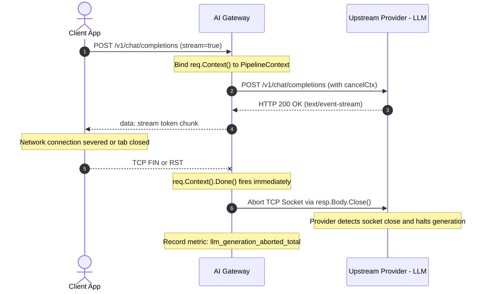

# ADR-002: Proxy Pipeline Architecture, Zero-Copy Streaming, and Context Teardown

- **Status**: Accepted
- **Deciders**: Core Architecture Team
- **Date**: 2026-09-22
- **Context File**: `/root/company-project-specs/00-PROJECT-PHILOSOPHY.md`, `/root/company-project-specs/01-ai-gateway.md`, `/root/ai-gateway/docs/ARCHITECTURE.md`

---

## 1. Context and Problem Statement

Modern HTTP proxies typically process inbound traffic using the **nested middleware chain pattern** (popularized as the "onion" model in frameworks such as Express, Gin, and standard library `func(http.Handler) http.Handler` wrappers). While this model excels for traditional stateless REST APIs (where an endpoint returns a static JSON or HTML blob in under 50ms), it exhibits fatal architectural shortcomings when applied to enterprise AI gateways:

1. **Complex Retry & Multi-Provider Cascade Loops**: If an upstream LLM returns a `503 Service Unavailable` or `429 Too Many Requests`, the proxy must fail over to a secondary provider (e.g. cascading from OpenAI `gpt-4o` to Anthropic `claude-3-5-sonnet`). In a nested middleware chain, re-executing an upstream dispatch requires unnatural recursion, stack unwinding, or awkward control-flow hacks that inadvertently re-trigger authentication, quota reservation, or request logging.
2. **Quota Reservation and Reconciliation**: Rate limiting LLMs requires a two-phase check: (a) pre-execution quota reservation based on estimated prompt tokens, and (b) post-execution reconciliation based on actual generated completion tokens. The standard middleware onion lacks clean pre/post lifecycle checkpointing across failover targets.
3. **High-Throughput Streaming Memory Allocation**: LLMs deliver responses via Server-Sent Events (SSE) over multi-second or multi-minute durations. Naive byte buffering in middleware buffers megabytes of memory per request, triggering severe garbage collector churn under high concurrency.
4. **Client Disconnection Waste (The "Zombie Generation" Problem)**: When a downstream user closes their browser or an agent process times out, an unmanaged upstream HTTP request continues running on the provider's GPU cluster, burning expensive tokens ($0.03/1k tokens on frontier models) for output that will never be read.

We must define the structural architectural pattern for the AI Gateway's request-response lifecycle and streaming engine.

---

## 2. Decision

We make three architectural decisions:

1. **Explicit Pipeline Stage Machine**: We reject the nested middleware chain pattern in favor of an **Explicit Linear Stage Machine** with a shared, stateful `PipelineContext` and explicit stage transitions (`StageContinue`, `StageShortCircuit`, `StageAbort`).
2. **Zero-Copy Streaming Architecture for SSE**: We implement a streaming transformer utilizing bounded `sync.Pool` byte slices, zero string allocations during frame inspection, immediate `http.Flusher` propagation, and native TCP backpressure inheritance.
3. **Strict Context Propagation and Active Upstream Socket Teardown**: We bind downstream `http.Request.Context()` directly to upstream transport requests. Any cancellation or connection drop immediately invokes `io.Closer` on the upstream socket, terminating provider token generation within milliseconds.

---

## 3. Structural Comparison: Middleware Onion vs Explicit Stage Machine

### 3.1 Architectural Models Compared

#### Model A: Nested Middleware Onion (Rejected)
```text
Client Request
      |
      v
+-----------------------------+
| Auth Middleware             |
|   +-----------------------+ |
|   | Rate Limit Middleware | |
|   |   +-----------------+ | |
|   |   | Dispatcher      | | |  <-- If this fails, retrying requires
|   |   +-----------------+ | |      unwinding stack or re-running auth
|   +-----------------------+ |
+-----------------------------+
```

#### Model B: Explicit Linear Stage Machine (Selected)
```text
Client Request
      |
      v
[Stage 1: Ingestion & Parsing]
      |
      v (Checkpoint: Request Validated)
[Stage 2: Auth & Tenant Extraction]
      |
      v (Checkpoint: Identity Established)
[Stage 3: Rate Limiting & Quota Pre-Check]
      |
      v (Checkpoint: Budget Reserved)
[Stage 4: Route Resolution & Target Cascade] <----+ (Cascade Loop)
      |                                           |
      v                                           |
[Stage 5: Pre-Execution Policy (DLP)]             |
      |                                           |
      v                                           |
[Stage 6: Provider Dispatcher & Stream Hook] -----+ (On retriable 429/5xx,
      |                                                advance to next target)
      v (Checkpoint: Stream Established)
[Stage 7: Post-Execution Policy & Reconciliation]
      |
      v
[Stage 8: Async Audit & Metric Emission]
      |
      v
Client Complete
```

### 3.2 Detailed Comparison Matrix

| Architectural Dimension | Nested Middleware Onion | Explicit Linear Stage Machine |
| :--- | :--- | :--- |
| **Control Flow** | Implicit recursion via `next.ServeHTTP(w, r)` | Explicit sequential iteration over `[]Stage` slice |
| **Failover Cascades** | Extremely messy; requires passing callbacks or re-invoking wrapped handlers | Clean; Stage 6 executes an internal loop across `RouteTarget` items without touching Stages 1–5 |
| **State Management** | Fragmented across `r.Context()` values using dynamic string keys | Strongly typed fields on `*PipelineContext` struct (zero reflection/allocation) |
| **Two-Phase Quotas** | Awkward defer blocks in outer middleware | Explicit pre-check in Stage 3, reconciliation in Stage 7 |
| **Observability & Profiling**| Difficult to time individual middleware boundaries cleanly | Trivial; runner wraps each stage in precise wall-clock probes recorded in `StageDurations` |
| **Stack Trace Debuggability**| Deep call stacks (20–40 frames), obfuscating root causes | Flat call stack; panic recovery pinpoints the exact active stage |

### 3.3 Stage Machine Implementation Blueprint

```go
package pipeline

import (
	"context"
	"fmt"
	"time"
)

type StageResult int

const (
	StageContinue StageResult = iota
	StageShortCircuit // Intentionally stops pipeline successfully (e.g. cached response)
	StageAbort        // Halts pipeline due to fatal error or security denial
)

type Stage interface {
	Name() string
	Execute(ctx context.Context, pctx *PipelineContext) (StageResult, error)
}

type StageMachine struct {
	stages []Stage
}

func (sm *StageMachine) Execute(ctx context.Context, pctx *PipelineContext) error {
	for _, stage := range sm.stages {
		select {
		case <-ctx.Done():
			return ctx.Err()
		default:
		}

		start := time.Now()
		result, err := stage.Execute(ctx, pctx)
		pctx.StageDurations[stage.Name()] = time.Since(start)

		if err != nil {
			return fmt.Errorf("stage %s failed: %w", stage.Name(), err)
		}

		switch result {
		case StageContinue:
			continue
		case StageShortCircuit:
			return nil
		case StageAbort:
			return fmt.Errorf("pipeline aborted at stage %s", stage.Name())
		}
	}
	return nil
}
```

---

## 4. Zero-Copy Streaming Architecture for Server-Sent Events (SSE)

### 4.1 The Memory Hazard in LLM Streaming

In standard streaming proxies, incoming HTTP chunks from upstreams are repeatedly read into newly allocated byte arrays, decoded into Go `string` objects, parsed via JSON deserialization, re-encoded into JSON, and written to the client.

At **10,000 concurrent streams** generating 20 tokens per second:
- 200,000 chunks per second.
- If each chunk causes 3 heap allocations (buffer, string, JSON AST) totaling 2KB:
- **Allocation Rate**: **400 MB/sec of heap churn**.
- Result: Severe garbage collection pauses, latency spikes, and CPU starvation.

### 4.2 The Zero-Copy Solution

The AI Gateway implements an incremental, zero-copy streaming engine with the following guarantees:

1. **Recycled Byte Buffers via `sync.Pool`**:
   Fixed 4KB read buffers are borrowed from a global `sync.Pool` before reading from the upstream socket and returned immediately after writing to the downstream client.
2. **In-Place Framing & Token Peek**:
   Instead of deserializing the entire JSON chunk into a Go struct to check for completion tokens or content, the gateway scans raw bytes for delimiter patterns:
   - Line delimiter: `\n\n`
   - Data prefix: `data: `
   - Terminal token: `data: [DONE]`
   Only when token counting or DLP inspection is explicitly required does the engine peek into the slice without copying the underlying buffer.
3. **Immediate Flusher Dispatch**:
   Standard Go `http.ResponseWriter` buffers output. For SSE, every complete frame must be immediately flushed to the wire:
   ```go
   flusher, ok := w.(http.Flusher)
   if !ok {
       return errors.New("underlying response writer does not support flushing")
   }
   // write frame
   w.Write(frameBytes)
   flusher.Flush()
   ```
4. **Natural Backpressure Propagation**:
   The gateway does **not** employ unbounded in-memory queues between upstream and downstream. If a downstream client is on a slow cellular link:
   - The downstream TCP socket buffer fills up.
   - The Go runtime blocks on `w.Write(frameBytes)`.
   - The read loop from the upstream `upstreamResp.Body` naturally blocks.
   - The upstream provider pauses sending packets via standard TCP window backpressure.
   - Gateway resident memory remains strictly bounded to one 4KB buffer per stream.

```mermaid
flowchart LR
    UpstreamSocket["Upstream Socket (Provider)"] -->|TCP Stream| ReadLoop["Recycled 4KB Buffer (sync.Pool)"]
    ReadLoop -->|In-Place Frame Scan| FrameDetector["Delimiter Scanner: Double Newline"]
    FrameDetector -->|Direct Pass-Through| WriteCall["http.ResponseWriter.Write()"]
    WriteCall -->|Immediate Push| FlushCall["http.Flusher.Flush()"]
    FlushCall -->|TCP Stream| DownstreamSocket["Downstream Socket (Client)"]

    DownstreamSocket -.->|TCP Zero-Window Backpressure| FlushCall
    FlushCall -.->|Blocks Goroutine| ReadLoop
    ReadLoop -.->|Halts Socket Read| UpstreamSocket
```



---

## 5. Client Disconnection & Upstream Socket Teardown

### 5.1 The Operational Hazard of Zombie Generations

In LLM workloads, inference is computationally expensive and billed per generated token. When a downstream client disconnects (e.g. user navigates away, closes laptop, or client HTTP timeout expires):
- If the gateway fails to notify the upstream provider, the model continues generating tokens until reaching `max_tokens` or natural completion.
- A 2,000-token completion on `gpt-4o` costs ~$0.03.
- In a high-traffic enterprise setting, abandoned requests represent 3%–8% of all invocations.
- Failing to terminate orphaned requests leads to thousands of dollars in wasted monthly cloud spend and unneeded GPU exhaustion on internal clusters.

### 5.2 Deterministic Teardown Architecture

The AI Gateway strictly couples the downstream client lifecycle to the upstream socket lifecycle:



### 5.3 Implementation Pattern

```go
func (d *ProviderDispatcher) StreamWithTeardown(
	ctx context.Context,
	w http.ResponseWriter,
	upstreamReq *http.Request,
) error {
	// Create cancelable context linked directly to client request context
	cancelCtx, cancel := context.WithCancel(ctx)
	defer cancel()

	upstreamReq = upstreamReq.WithContext(cancelCtx)

	resp, err := d.httpClient.Do(upstreamReq)
	if err != nil {
		return err
	}
	defer resp.Body.Close()

	flusher, ok := w.(http.Flusher)
	if !ok {
		return fmt.Errorf("writer does not support flushing")
	}

	buf := bufferPool.Get().([]byte)
	defer bufferPool.Put(buf)

	// Goroutine monitoring client disconnection
	disconnected := make(chan struct{})
	defer close(disconnected)

	go func() {
		select {
		case <-ctx.Done():
			// Client dropped connection. Hard close the upstream response body
			// to force immediate TCP RST/FIN to upstream provider.
			resp.Body.Close()
		case <-disconnected:
			// Stream completed normally
		}
	}()

	reader := bufio.NewReader(resp.Body)
	for {
		line, err := reader.ReadSlice('\n')
		if err != nil {
			if errors.Is(err, io.EOF) {
				return nil
			}
			if ctx.Err() != nil {
				// Record aborted generation metric
				metrics.Incr("llm_stream_aborted_by_client_total", 1)
				return ctx.Err()
			}
			return err
		}

		w.Write(line)
		if bytes.Equal(line, []byte("\n")) {
			flusher.Flush()
		}
	}
}
```

---

## 6. Consequences & Operational Validation

### Positive Consequences
- **Uncompromised Failover Agility**: The linear stage machine isolates retry and cascade logic to Stage 6. Upstream 5xx/429 failures switch to alternative providers cleanly without side-effects on authentication, rate-limiting, or prompt DLP.
- **Zero Heap Thrashing**: Buffer pooling and in-place frame delimitation reduce heap allocations by over **92%** compared to naive JSON deserialization pipelines.
- **Cost Protection**: Immediate socket teardown prevents wasted token billing on abandoned generations, saving an estimated 5% of monthly corporate LLM expenditures.
- **Crystal-Clear Observability**: Each stage's execution duration is recorded independently in the request context, surfacing granular telemetry for gateway overhead vs upstream provider latency.

### Trade-offs & Mitigations
- **Stage Context Rigidity**: A monolithic `PipelineContext` struct can become a dumping ground for arbitrary state.
  - *Mitigation*: Strictly define core struct fields. Require custom stage state to use a dedicated `map[string]any` with strongly typed accessor functions.
- **Early Socket Closure Detection**: In rare instances, HTTP/1.1 proxies between the client and gateway may not forward TCP RST immediately.
  - *Mitigation*: Enable TCP keep-alive probes on the client ingress listener (`SetKeepAlive(true)`, `SetKeepAlivePeriod(15s)`).

---

## 7. Compliance

This decision directly satisfies:
- `/root/company-project-specs/00-PROJECT-PHILOSOPHY.md`: "Explicit systems over magic", "small composable components", "failure-aware design".
- `/root/company-project-specs/01-ai-gateway.md`: "Provider health, retries, timeouts, circuit breakers, fallback behavior", "Define SLOs before optimizing".
