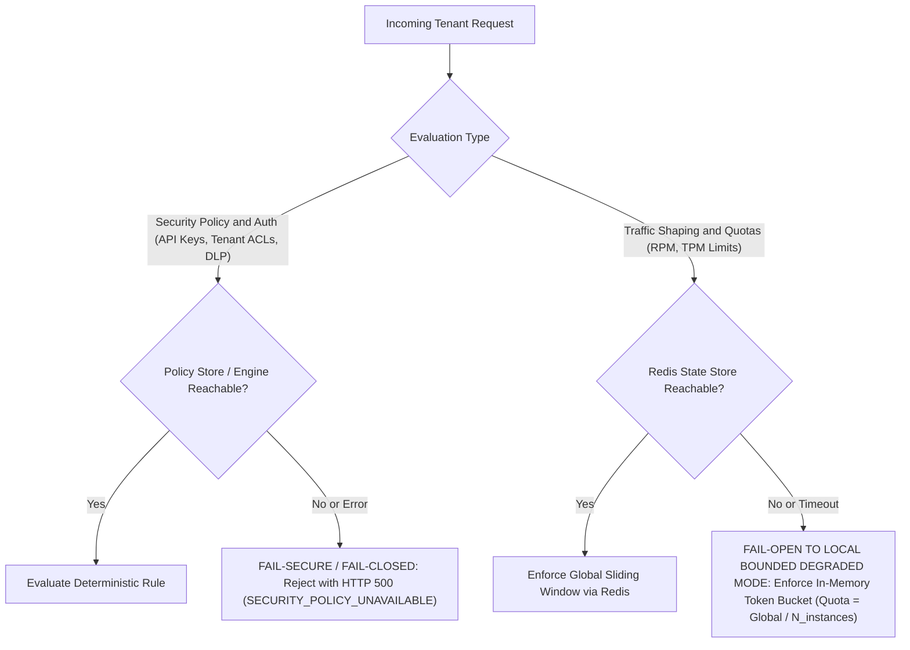

# ADR-003: State Management, Rate Limiting, and Partition Handling Strategy

## Status
Accepted

## Date
2026-09-22

## Context & Problem Statement

The AI Gateway (`ai-gateway`) acts as the centralized control plane between company applications and external/internal LLM model providers, as mandated by `/root/company-project-specs/01-ai-gateway.md`.

Managing rate limits and usage quotas in an AI gateway introduces challenges fundamentally different from standard HTTP microservice proxies:
1. **Multi-Dimensional Accounting**: Traffic must be throttled not only by Requests Per Minute (RPM) and concurrent connections, but also by Tokens Per Minute (TPM) and daily/monthly token budgets.
2. **Variable and Asynchronous Cost**: In standard HTTP APIs, each request consumes 1 unit of quota. In LLMs, a request may consume 100 prompt tokens and 4,000 completion tokens. The true token cost cannot be known until the model has finished streaming its final chunk.
3. **Multi-Instance Coordination**: The gateway runs as a horizontally autoscaled cluster (typically 3 to 20 nodes). Purely local state causes quota drift where tenants can consume up to $N \times$ their global allocation.
4. **State Store Failure Dynamics**: If the central state store (Redis) experiences a network partition, hardware failure, or failover stall, the gateway must handle incoming traffic deterministically without compromising system security.

We must define the architectural strategy for distributed state tracking, rate limiting algorithms, and the partition behavior separating security policy from traffic shaping.

---

## Decision Drivers

- **Sub-Millisecond Overhead**: The rate limiting check must execute within $< 1.5\,\text{ms}$ at p99 to fit inside the gateway's total p99 overhead budget of 15ms.
- **Accurate Token Quota Enforcement**: Prevent upstream provider account suspension caused by tenant surges exceeding organizational TPM ceilings.
- **High Availability During Partitions**: An outage of an internal state store must not cause a company-wide outage of customer-facing AI applications.
- **Zero Security Compromise**: Adherence to the core principle in `00-PROJECT-PHILOSOPHY.md`: "AI proposes. Deterministic systems enforce." Security boundaries must remain absolute.

---

## Considered Options

### Option 1: Pure Distributed State (Redis Cluster Synchronous)
All rate limits, token buckets, and policies are stored exclusively in a Redis cluster. Every gateway node synchronously calls Redis before and after each request.
- *Pros*: Perfectly synchronized global counters across all nodes; zero state drift.
- *Cons*: Redis becomes a single point of complete failure. Any Redis network partition or slow query directly halts all gateway traffic or causes cascading request drops.

### Option 2: Pure Local In-Memory State (Static Partitioning)
Each gateway instance maintains isolated in-memory token buckets, dividing tenant quotas by the number of active gateway replicas ($Q_{\text{local}} = Q_{\text{global}} / N$).
- *Pros*: Zero external network dependencies for rate limiting; sub-microsecond latency.
- *Cons*: Horizontally autoscaling nodes causes quota re-partitioning churn; non-uniform load distribution behind L4 load balancers causes false 429s on busy nodes while other nodes remain idle.

### Option 3: Tiered Hybrid State (Primary Distributed Redis with Local Autonomous Degraded Fallback)
Primary state is maintained in Redis using atomic Lua scripts. If Redis becomes partitioned or fails health checks, nodes instantly decouple and switch to local in-memory token buckets initialized with conservative, fractional quotas. Security policies remain strictly local and fail-closed.
- *Pros*: Global quota consistency during normal operation; uninterrupted service delivery during Redis downtime; sub-millisecond execution.
- *Cons*: Requires maintaining two rate-limiting execution paths in the codebase.

---

## Decision Outcome

**Chosen Option**: **Option 3: Tiered Hybrid State**.

We choose this option because it guarantees global quota consistency under normal operations while ensuring total fault tolerance during internal dependency outages, without violating security boundaries.

### 1. Two-Phase Token Reservation & Reconciliation Algorithm

Because LLM generation token count is non-deterministic at the start of a request, standard single-pass token bucket algorithms are inadequate. The gateway implements a two-phase reservation protocol:

```
Downstream Client            AI Gateway                   Redis Cluster              Upstream Provider
       |                          |                             |                            |
       |--- POST /chat ---------->|                             |                            |
       |                          |-- Phase 1: Reserve Tokens ->|                            |
       |                          |   (Prompt + Est. Max Tokens)|                            |
       |                          |<-- Reservation Granted -----|                            |
       |                          |                                                          |
       |                          |--- POST /v1/chat/completions (Stream) ------------------>|
       |                          |<-- SSE Stream (Tokens emitted) --------------------------|
       |<- Stream Chunks ---------|                                                          |
       |                          |<-- [DONE] usage: {prompt: 120, completion: 350} --------|
       |                          |                                                          |
       |                          |-- Phase 2: Reconcile Actual>|                            |
       |                          |   (Refund over-reservation)|                            |
       |                          |<-- Counter Settled ---------|                            |
       |<- Response Finished -----|                             |                            |
```

#### Phase 1: Upfront Reservation
1. Gateway parses prompt text and calculates prompt token count $T_{\text{prompt}}$ using an embedded high-speed tokenizer (e.g., tiktoken BPE).
2. Gateway extracts `max_tokens` from request parameters. If omitted, it applies a default conservative reservation ceiling $T_{\text{res}} = 1{,}000\,\text{tokens}$.
3. Total reservation request: $T_{\text{total\_res}} = T_{\text{prompt}} + T_{\text{res}}$.
4. Gateway executes an atomic Redis Lua reservation script. If the tenant's current TPM or burst allowance is insufficient, the request is rejected immediately with HTTP 429.

#### Phase 2: Post-Stream Reconciliation
1. As the upstream provider emits tokens, the stream interceptor counts completion tokens.
2. Upon stream termination or receipt of the provider's final `usage` metadata block, the exact actual usage $T_{\text{actual}} = T_{\text{prompt\_actual}} + T_{\text{comp\_actual}}$ is established.
3. Gateway dispatches an asynchronous reconciliation script to Redis:
   $$\Delta = T_{\text{total\_res}} - T_{\text{actual}}$$
   If $\Delta > 0$, the over-reserved tokens are immediately credited back to the tenant's sliding window bucket.

---

### 2. Sliding Window Counter Implementation (Redis Lua Script)

To prevent boundary-reset attacks inherent in fixed-window limiters, rate limits are enforced via sliding window counter logic executed atomically in Redis:

```lua
-- Redis Lua Script: sliding_window_rate_limit.lua
-- KEYS[1]: Rate limit key (e.g., ratelimit:{tenant_id}:rpm)
-- ARGV[1]: Current Unix timestamp with millisecond precision
-- ARGV[2]: Window size in milliseconds (e.g., 60000 for 1 minute)
-- ARGV[3]: Maximum allowed capacity (e.g., 1000 requests)
-- ARGV[4]: Cost for this operation (e.g., 1 for RPM, N for tokens)

local key = KEYS[1]
local now = tonumber(ARGV[1])
local window = tonumber(ARGV[2])
local max_capacity = tonumber(ARGV[3])
local cost = tonumber(ARGV[4])
local clear_before = now - window

-- Remove entries outside the sliding window
redis.call('ZREMRANGEBYSCORE', key, '-inf', clear_before)

-- Sum existing consumption in the current window
local entries = redis.call('ZRANGEBYSCORE', key, clear_before, '+inf')
local current_usage = 0
for i, entry in ipairs(entries) do
    -- Format: "<timestamp>:<cost>:<unique_nonce>"
    local sep1 = string.find(entry, ":")
    local sep2 = string.find(entry, ":", sep1 + 1)
    if sep1 and sep2 then
        local entry_cost = tonumber(string.sub(entry, sep1 + 1, sep2 - 1))
        if entry_cost then
            current_usage = current_usage + entry_cost
        end
    end
end

-- Check if adding cost exceeds limit
if current_usage + cost <= max_capacity then
    -- Record this request with unique ID
    local member = now .. ":" .. cost .. ":" .. redis.call('INCR', 'nonce:counter')
    redis.call('ZADD', key, now, member)
    redis.call('PEXPIRE', key, window + 1000)
    return {1, max_capacity - (current_usage + cost), 0} -- Allowed, Remaining, RetryAfter
else
    -- Calculate Retry-After based on oldest entry in window
    local oldest = redis.call('ZRANGE', key, 0, 0, 'WITHSCORES')
    local retry_after_ms = 1000
    if oldest and #oldest >= 2 then
        retry_after_ms = math.max(0, (tonumber(oldest[2]) + window) - now)
    end
    return {0, 0, math.ceil(retry_after_ms / 1000)} -- Denied, Remaining, RetryAfterSeconds
end
```

---

### 3. Handling State Store Partitions: Fail-Open vs Fail-Secure Rationale

When a network partition disconnects the gateway cluster from Redis, the gateway enforces a strict architectural bifurcation based on the nature of the policy:



#### 3.1. Security Policy & Authorization: FAIL-SECURE (Fail-Closed)
- **Policy Scope**: API key authentication, mTLS identity verification, tenant-to-model access control lists (ACLs), and Data Loss Prevention (DLP) prompt inspection.
- **Rule**: If the policy engine, cryptographic verification key cache, or authorization database is unavailable or returns an error, the gateway **must reject the request immediately**.
- **Rationale**: Security boundaries are deterministic safety controls. Allowing traffic to bypass tenant authorization or DLP scanning during an infrastructure hiccup creates unacceptable exposure to data exfiltration, privilege escalation, and compliance violations. Availability must never take precedence over security isolation.

#### 3.2. Rate Limiting & Token Quotas: FAIL-OPEN WITH LOCAL DEGRADED BOUNDS
- **Policy Scope**: Per-tenant RPM limits, hourly TPM ceilings, and organizational budget tracking.
- **Rule**: If Redis operations timeout (> 50ms) or fail with transport errors, the gateway **must not reject production customer requests**. It immediately transitions to `LOCAL_DEGRADED` mode.
- **Mechanism**:
  - Each gateway node maintains an autonomous, thread-safe in-memory token bucket.
  - While degraded, the node computes a conservative local limit:
    $$\text{Local Limit} = \frac{\text{Global Limit}}{N_{\text{active\_nodes}}}$$
  - The node uses its last known healthy node count ($N$) or a default conservative cluster estimate ($N=5$).
  - When Redis connectivity is restored (verified by 3 consecutive health pings), the node gracefully shifts traffic accounting back to the shared Redis sliding window.
- **Rationale**: A temporary partition of an internal rate-limit cache must not cascade into an outage of core business applications calling LLM services. Local degraded enforcement bounds the total potential upstream impact while maintaining unbroken service availability for downstream users.

---

## Consequences

### Positive
- Prevents upstream provider quota exhaustion during normal operating conditions.
- Guarantees high availability for downstream consumers even during severe internal state store partitions.
- Clear, unambiguous distinction between safety-critical security boundaries and operational traffic throttling.
- Predictable and auditable token reservations preventing financial overruns.

### Negative & Trade-offs
- Two distinct rate limiting engines (Redis Lua script and in-memory token bucket) must be tested and maintained.
- During a Redis network partition, if traffic distribution across gateway pods is uneven, some active pods may exhaust their local fractional quota before others, leading to localized 429 responses.
- Small transient token accounting inaccuracies (up to 5%) may occur during the immediate transition window between distributed and degraded modes.
